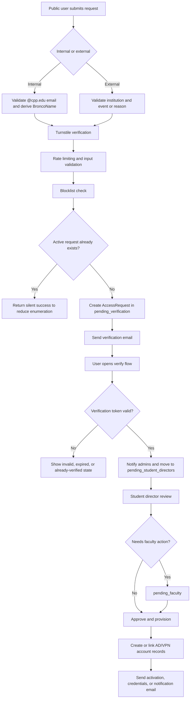
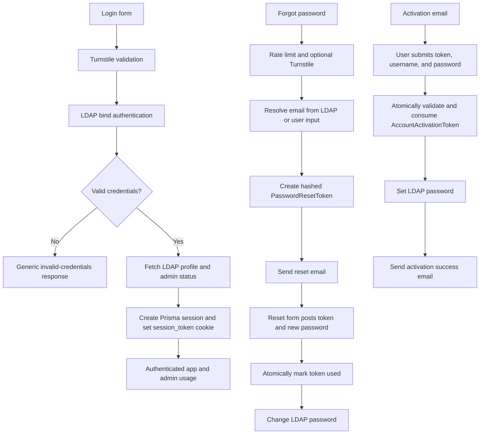
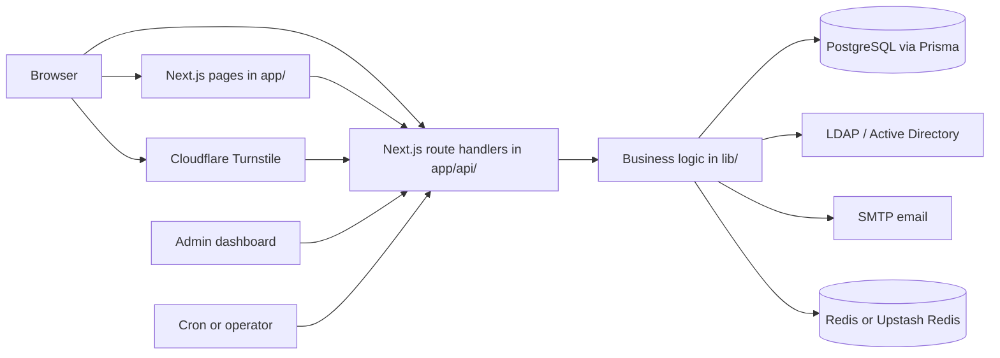

# UAR Portal

The UAR (User Access Request) Portal is a full-stack access request, account provisioning, and operations console for the Mitchell C. Hill Student Data Center and the Cal Poly Pomona student-led Security Operations Center.

This README is the canonical public reference for this repository. It is written against the current codebase in `my-app/` and is intended to be the single human-readable source of truth for what the application does, how it is structured, and how it is started.

## Table of Contents

- [At a Glance](#at-a-glance)
- [What the Portal Does](#what-the-portal-does)
- [End-to-End Workflows](#end-to-end-workflows)
- [Runtime Surface](#runtime-surface)
- [Architecture](#architecture)
- [Data Model](#data-model)
- [Security and Control Model](#security-and-control-model)
- [Technology Stack](#technology-stack)
- [Getting Started](#getting-started)
- [Environment Variables](#environment-variables)
- [Deployment and Operations](#deployment-and-operations)
- [Repository Layout](#repository-layout)
- [Maintaining This README](#maintaining-this-readme)

## At a Glance

The portal combines public intake, identity verification, LDAP-backed authentication, administrative review, account provisioning, support workflows, and operational automation in one Next.js App Router application.

The current codebase contains:

| Area | Current Count |
| --- | ---: |
| App pages | 26 |
| API route handlers | 87 |
| Admin components | 24 |
| Prisma models | 30 |

The application is not a generic demo. It expects real infrastructure:

- PostgreSQL for operational data
- LDAP / Active Directory over LDAPS for authentication and account operations
- SMTP for transactional email
- Redis or Upstash Redis for distributed rate limiting
- Cloudflare Turnstile for public-form abuse protection

## What the Portal Does

The UAR Portal manages the full access lifecycle for two main audiences:

- Internal users, primarily `@cpp.edu` users who may require Active Directory-backed access
- External users, such as visitors, event participants, or temporary users who may require time-bound access

Core responsibilities in the current codebase:

- Public request intake for internal and external access requests
- Email verification before requests enter reviewer queues
- Student director review and routing
- Faculty review and approval paths
- Active Directory account creation, linking, password operations, and expiration handling
- VPN account management, status changes, imports, and matching
- First-time account activation and password reset flows
- User profile lookup from LDAP
- Authenticated support ticket creation and response handling
- Batch account creation for multi-user operational work
- Account lifecycle scheduling and queued processing
- System settings, banners, notifications, blocklists, audit logging, and session management
- Infrastructure synchronization between existing directory/infrastructure records and portal records

## End-to-End Workflows

### Access Request Lifecycle



What the code does during submission:

- `POST /api/request` validates JSON payload size, required fields, and string lengths.
- Public submissions require a valid Cloudflare Turnstile token.
- Internal requests must use `@cpp.edu`.
- External requests must include an institution and either an event reason or one or more active event IDs.
- Selected event IDs are checked against active `Event` records.
- Blocked email addresses are rejected before a request record is created.
- Duplicate active requests are intentionally answered with a success response instead of a conflict response to reduce user enumeration.
- Verification tokens are generated for 24 hours.

Internal-request handling has additional logic:

- The email prefix is extracted and used as the expected BroncoName / username basis.
- LDAP is queried to detect a "grandfathered" account: an existing AD account without an email address already attached.
- If such an account exists, the request is marked to link to the existing account instead of creating a new one.

Verification behavior:

- `POST /api/verify/confirm?token=...` rate-limits both by IP and by token.
- Verification attempts are counted in the database.
- If admin notification succeeds, the request becomes `pending_student_directors`.
- If notification email fails, the request is marked for notification retry and the user still sees a successful verification state.

The status values explicitly observed in code are:

- `pending_verification`
- `pending_student_directors`
- `pending_faculty`
- `approved`
- `rejected`

### Authentication, Activation, and Password Recovery



Current authentication behavior from the code:

- `POST /api/auth/login` checks whether logins are globally disabled in `SystemSettings`.
- Logins require Cloudflare Turnstile plus LDAP authentication.
- Admin state is not trusted solely from the session. Admin API routes re-check domain-admin membership through LDAP.
- Sessions are stored in Prisma with hashed tokens, expiry, last activity, IP address, and user agent.
- Creating a new session deletes any existing sessions for that username, so the portal enforces one active session per user.

Current session behavior:

- Session cookie name: `session_token`
- Cookie flags: `HttpOnly`, `SameSite=strict`, `secure` by default
- Default max age: 30 minutes for admins, 60 minutes for non-admin users
- Idle timeout: 15 minutes
- `AUTH_SESSION_MAX_AGE` can override the max age

Password reset behavior:

- Public reset requests require Turnstile when the user is not already identified by username.
- The portal returns a uniform success message even when the target account does not exist or is in an ineligible state.
- Password reset tokens are stored as SHA-256 hashes, not plaintext.
- Reset token consumption is wrapped in a serializable Prisma transaction to reduce race conditions.
- If the LDAP password-change operation fails, token usage is rolled back so the user can retry.

Account activation behavior:

- Activation tokens are also stored hashed and consumed transactionally.
- The request must already be `approved`.
- The request must belong to an internal user.
- The submitted username must match the request's stored LDAP username.
- If LDAP password-setting fails, token state is rolled back and the user receives a safe error response.

### Administrative Operations and Scheduled Processing

```mermaid
flowchart LR
  A[Admin dashboard] --> B[Requests, events, users, support, VPN, batch, settings]
  B --> C[Admin API routes]
  C --> D[(PostgreSQL via Prisma)]
  C --> E[LDAP / Active Directory]
  C --> F[SMTP notifications]
  C --> G[Audit log entries]

  H[Lifecycle queue] --> I[/api/admin/account-lifecycle/process]
  J[Cron caller] --> K[/api/cron/process-lifecycle-queue]
  I --> L[Lifecycle processor]
  K --> L
  L --> D
  L --> E
```

Operational workflows implemented in the code include:

- Request review, comments, routing, approval, rejection, resend flows, and manual assignment
- Batch account creation that validates accounts, generates usernames/passwords, provisions LDAP users, and emails credentials
- VPN account management, imports, record matching, comments, bulk status updates, and cleanup routes
- Account lifecycle queue processing for disable, enable, revoke, restore, and related actions
- Infrastructure sync from existing systems back into the portal database, including `dryRun`, latest status, history, and detail views

## Runtime Surface

### Page Inventory

The current page routes in `my-app/app` are:

| Area | Routes |
| --- | --- |
| Public landing and intake | `/`, `/request/internal`, `/request/external`, `/request/success`, `/instructions` |
| Authentication and recovery | `/login`, `/forgot-password`, `/reset-password` |
| Verification and onboarding | `/verify/confirm`, `/verify/success`, `/verify/error`, `/verify/already-verified`, `/account/welcome`, `/account/activate`, `/account/activate/expired`, `/account/reset-password` |
| User self-service | `/profile`, `/support/create`, `/support/tickets`, `/support/tickets/[id]` |
| Admin | `/admin`, `/admin/search`, `/admin/batch-accounts`, `/admin/batch-accounts/[id]`, `/admin/requests/[id]`, `/admin/support/tickets/[id]` |

### API Route Inventory

The current API surface in `my-app/app/api` is grouped below by function.

| Domain | Routes |
| --- | --- |
| Public request intake and verification | `/api/request`, `/api/verify`, `/api/verify/confirm`, `/api/events/active` |
| Authentication, session, and CSRF | `/api/auth/login`, `/api/auth/logout`, `/api/auth/session`, `/api/auth/check-admin`, `/api/csrf-token` |
| Password recovery and account activation | `/api/auth/request-password-reset`, `/api/auth/reset-password`, `/api/account/activate` |
| User profile and email verification | `/api/profile`, `/api/profile/check-records`, `/api/profile/verify-email`, `/api/profile/verify-email/confirm` |
| User support and banner data | `/api/support/tickets`, `/api/support/tickets/[id]`, `/api/support/tickets/[id]/responses`, `/api/settings/banner` |
| Scheduled processing | `/api/cron/process-lifecycle-queue` |
| Admin access request management | `/api/admin/requests`, `/api/admin/requests/[id]`, `/api/admin/requests/[id]/acknowledge`, `/api/admin/requests/[id]/approve`, `/api/admin/requests/[id]/reject`, `/api/admin/requests/[id]/comments`, `/api/admin/requests/[id]/create-account`, `/api/admin/requests/[id]/save-credentials`, `/api/admin/requests/[id]/manual-assign`, `/api/admin/requests/[id]/send-to-faculty`, `/api/admin/requests/[id]/return-to-faculty`, `/api/admin/requests/[id]/move-back`, `/api/admin/requests/[id]/resend-verification`, `/api/admin/requests/[id]/resend-activation`, `/api/admin/requests/[id]/resend-notification`, `/api/admin/requests/[id]/reset-password`, `/api/admin/requests/[id]/update-account`, `/api/admin/requests/[id]/notify-faculty`, `/api/admin/requests/[id]/undo-notify-faculty` |
| Admin directory, account search, and group management | `/api/admin/users`, `/api/admin/groups`, `/api/admin/groups/[groupName]/members`, `/api/admin/ad-search`, `/api/admin/ad-comments/[accountId]`, `/api/admin/ad-comments/comment/[id]`, `/api/admin/search`, `/api/admin/check-username`, `/api/admin/generate-password` |
| Admin VPN management and import pipeline | `/api/admin/vpn-accounts`, `/api/admin/vpn-accounts/[id]`, `/api/admin/vpn-accounts/[id]/status`, `/api/admin/vpn-accounts/[id]/comments`, `/api/admin/vpn-accounts/bulk-status`, `/api/admin/vpn-import`, `/api/admin/vpn-import/[id]`, `/api/admin/vpn-import/process`, `/api/admin/vpn-import/match`, `/api/admin/vpn-import/cleanup`, `/api/admin/vpn-import/clear` |
| Admin batch operations | `/api/admin/batch-accounts`, `/api/admin/batch-accounts/create`, `/api/admin/batch-accounts/[id]`, `/api/admin/batch-accounts/[id]/cancel`, `/api/admin/batch-accounts/cleanup` |
| Admin lifecycle and sync | `/api/admin/account-lifecycle`, `/api/admin/account-lifecycle/process`, `/api/admin/account-lifecycle/batch`, `/api/admin/account-lifecycle/[id]`, `/api/admin/account-lifecycle/[id]/retry`, `/api/admin/account-lifecycle/[id]/cancel`, `/api/admin/sync-status`, `/api/admin/settings/infrastructure-sync` |
| Admin governance and platform operations | `/api/admin/settings`, `/api/admin/notifications`, `/api/admin/notifications/[id]`, `/api/admin/blocklist`, `/api/admin/blocklist/[id]`, `/api/admin/events`, `/api/admin/events/[id]`, `/api/admin/logs`, `/api/admin/sessions`, `/api/admin/track-view`, `/api/admin/cleanup-passwords`, `/api/admin/support/tickets`, `/api/admin/logout` |

### Admin Dashboard Modules

The main admin dashboard imports and renders these tab modules:

| Admin tab | Purpose |
| --- | --- |
| `requests` | Review, comment on, route, approve, reject, assign, and provision access requests |
| `events` | Manage external-event records used by the public external request flow |
| `users` | Inspect LDAP-backed users and group/account state |
| `support` | Review support tickets, responses, and ticket state |
| `batch` | Create and inspect batch account creation work |
| `vpn` | Manage VPN accounts, imports, matches, and state transitions |
| `blocklist` | Prevent specific email addresses from submitting new requests |
| `settings` | Manage system controls, banners, and infrastructure sync tooling |
| `logs` | Review audit and operational log output |
| `sessions` | Inspect and revoke active user sessions |
| `lifecycle` | Queue, inspect, retry, cancel, and process lifecycle actions |
| `sync-status` | Inspect match state between portal, AD, and VPN records |
| `communications` | Drive manual communication and resend flows tied to requests |

## Architecture

The application is a single Next.js App Router project under `my-app/` with both frontend and backend code in the same repository.



Current architectural characteristics:

- Frontend pages and backend APIs live in the same Next.js application.
- Prisma is used for the system-of-record database.
- LDAP / Active Directory is used for identity validation, account creation, group membership work, and password operations.
- Redis-backed rate limiting is used when `REDIS_URL` is configured; otherwise the code falls back to in-memory limits.
- Most non-UI business logic lives in `my-app/lib/`.
- `middleware.ts` handles admin page gating, CSRF enforcement, request logging, and security headers.
- `next.config.ts` validates required environment variables at startup and build time before the app boots.

## Data Model

The Prisma schema currently defines 30 models. The main domains are:

| Domain | Models |
| --- | --- |
| Access governance | `AccessRequest`, `RequestComment`, `Event` |
| Tokenized onboarding and recovery | `PasswordResetToken`, `AccountActivationToken` |
| Support operations | `SupportTicket`, `TicketResponse`, `TicketStatusLog` |
| Batch account operations | `BatchAccountCreation`, `BatchAccountItem`, `BatchAuditLog` |
| VPN management | `VPNAccount`, `VPNAccountStatusLog`, `VPNAccountComment`, `VPNImport`, `VPNImportRecord`, `VPNRoleChange`, `VPNAccountActivityLog` |
| Sessions, settings, and governance | `Session`, `BlockedEmail`, `SystemSettings`, `NotificationBanner`, `AuditLog` |
| Lifecycle and sync | `AccountLifecycleAction`, `AccountLifecycleBatch`, `AccountLifecycleHistory`, `ADAccountSync`, `ADAccountMatch`, `ADAccountActivityLog`, `ADAccountComment` |

Key `AccessRequest` data tracked in the schema:

- Request identity and requestor metadata
- Internal vs external classification
- Event linkage and expiration data
- Verification token state and verification attempts
- Review and approval timestamps
- LDAP username, VPN username, and account password storage fields
- Provisioning status and error fields
- Manual assignment and grandfathered-account linkage
- AD and VPN lifecycle state fields such as disable, revoke, restore, and related reasons

Support ticket behavior reflected in the schema:

- Tickets belong to authenticated usernames
- Tickets can optionally reference an `AccessRequest`
- Ticket responses and ticket status changes are stored separately
- Batch account jobs can be linked back to a support ticket

Current schema caveat:

- The repository contains `schema.prisma`, but there is no checked-in Prisma migration directory at `my-app/prisma/migrations`.

## Security and Control Model

### Identity and Session Controls

- LDAP authentication is the source of truth for login.
- Admin access requires both a portal session marked as admin and a fresh LDAP admin-group check on protected admin API routes.
- Sessions are stored server-side in Prisma using hashed tokens.
- Session cookies are `HttpOnly`, `SameSite=strict`, and secure by default.
- Idle sessions are invalidated after 15 minutes of inactivity.
- New logins revoke previous sessions for the same username.

### Form, Token, and API Protections

- Public request submission, login, and public password reset flows use Cloudflare Turnstile.
- CSRF tokens are issued through `GET /api/csrf-token`.
- `middleware.ts` enforces CSRF checks on mutating requests except for explicitly exempt paths and admin `GET` routes.
- Reset and activation tokens are stored hashed and consumed transactionally.
- Duplicate request handling and password reset responses intentionally avoid revealing whether a user or request exists.
- LDAP timeout and retry behavior are configurable through environment variables. The current LDAP client helper defaults `LDAP_ALLOW_INVALID_CERTS` to `true` unless overridden, so production deployments should explicitly set `LDAP_ALLOW_INVALID_CERTS=false` unless self-signed certificates are intentionally trusted.

### Security Headers

`next.config.ts` and `middleware.ts` both contribute defense-in-depth headers, including:

- `Content-Security-Policy`
- `Strict-Transport-Security`
- `X-Frame-Options`
- `X-Content-Type-Options`
- `Referrer-Policy`
- `Permissions-Policy`
- `Cross-Origin-Embedder-Policy`
- `Cross-Origin-Opener-Policy`
- `Cross-Origin-Resource-Policy`

### Current Rate-Limit Behavior

Rate limiting is implemented in `my-app/lib/ratelimit.ts` and can run on Redis or in memory.

| Scope | Current behavior |
| --- | --- |
| Login preset | 200 requests per 15 minutes per IP |
| Request-submission preset | 200 requests per hour per IP, often with an additional identifier such as email |
| Password-reset preset | 100 requests per hour per IP, sometimes keyed by email or username |
| Verification preset | 600 requests per hour per IP |
| Admin-operation preset | 4000 requests per minute per IP, usually keyed by session ID |
| CSRF token endpoint | 100 requests per minute per IP |
| Verification token attempts | Additional 3 requests per hour per token |
| Activation attempts | Additional 5 requests per hour per IP plus username |

## Technology Stack

Versions below reflect the currently pinned dependencies in `my-app/package.json`.

| Layer | Current implementation |
| --- | --- |
| Framework | Next.js `16.0.8` |
| UI runtime | React `19.2.1` |
| Language | TypeScript `5.9.3` |
| Styling | Tailwind CSS 4, Radix UI, shadcn-style component patterns |
| Database access | Prisma `7.0.0` with PostgreSQL |
| Directory integration | `ldapts` |
| Email | `nodemailer` |
| Rate limiting / cache | `redis` and `@upstash/redis` support |
| Security helpers | `csrf-csrf`, Cloudflare Turnstile integration, bcrypt, custom session/token handling |
| Logging | Winston plus database-backed audit logging |
| Motion / UX utilities | Framer Motion, Sonner, Lucide icons |

## Getting Started

### Prerequisites

For a meaningful local, staging, or production deployment you need:

- Node.js 20+
- npm 10+
- PostgreSQL
- Redis or Upstash Redis
- LDAP / Active Directory reachable over LDAPS
- SMTP credentials
- Cloudflare Turnstile site and secret keys

Optional but useful:

- Docker and Docker Compose
- A scheduler that can call the lifecycle cron endpoint

### Application Root

The actual Next.js application root is `my-app/`.

Run application commands from there:

```bash
cd my-app
```

### 1. Install Dependencies

```bash
cd my-app
npm ci
```

### 2. Configure Environment Variables

For local development, put runtime variables in:

- `my-app/.env.local`, or
- your shell environment before starting Next.js

Important current behavior:

- `next.config.ts` validates environment variables during startup and build.
- The app exits early if required variables are missing or malformed.
- `DATABASE_URL` must include `sslmode=require` because that requirement is enforced in code.
- `LDAP_URL` must begin with `ldaps://`.

### 3. Prepare the Database

The repository includes a Prisma schema but no checked-in migration history.

For a fresh local database, the current simplest workflow is:

```bash
cd my-app
npx prisma generate
npx prisma db push
```

### 4. Start the Development Server

```bash
cd my-app
npm run dev
```

Default local address:

```text
http://localhost:3000
```

### 5. Optional: Start Local PostgreSQL and Redis with Docker

If you only want the infrastructure services locally:

```bash
docker compose up -d postgres redis
```

This does not remove the need for valid LDAP, SMTP, and Turnstile configuration.

## Environment Variables

The validator-backed required variables come from `my-app/lib/env-validator.ts`. Additional operational variables below are also referenced directly in the codebase.

### Required at Startup

| Variable | Required | Notes |
| --- | --- | --- |
| `DATABASE_URL` | Yes | Must be PostgreSQL and must include `sslmode=require`. |
| `SMTP_HOST` | Yes | SMTP hostname. |
| `SMTP_PORT` | Yes | SMTP port number. |
| `SMTP_USER` | Yes | SMTP username. |
| `SMTP_PASSWORD` | Yes | SMTP password. |
| `EMAIL_FROM` | Yes | Default sender address. |
| `ADMIN_EMAIL` | Yes | Default admin notification address. |
| `LDAP_URL` | Yes | Must start with `ldaps://`. |
| `LDAP_BIND_DN` | Yes | LDAP bind DN / service account DN. |
| `LDAP_BIND_PASSWORD` | Yes | LDAP bind password. |
| `LDAP_SEARCH_BASE` | Yes | Primary LDAP search base. |
| `LDAP_DOMAIN` | Yes | Domain used for auth and account naming. |
| `LDAP_ADMIN_GROUPS` | Yes | Group list used for portal admin checks. |
| `LDAP_GROUP2ADD` | Yes | Default group used during provisioning. |
| `LDAP_KAMINO_INTERNAL_GROUP` | Yes | Required by environment validation. |
| `LDAP_KAMINO_EXTERNAL_GROUP` | Yes | Required by environment validation. |
| `LDAP_GROUPSEARCH` | Yes | Group search base used by the app. |
| `NEXT_PUBLIC_APP_URL` | Yes | Public base URL for generated links and metadata. |
| `NEXTAUTH_SECRET` | Yes | Must be at least 32 characters. |
| `ENCRYPTION_SECRET` | Yes | Must be at least 32 characters. |
| `ENCRYPTION_SALT` | Yes | Must be at least 32 characters with sufficient entropy. |
| `NEXT_PUBLIC_TURNSTILE_SITE_KEY` | Yes | Public Turnstile site key. |
| `TURNSTILE_SECRET_KEY` | Yes | Server-side Turnstile secret. |

### Additional Operational Variables Referenced in Code

| Variable | Purpose |
| --- | --- |
| `REDIS_URL` | Enables Redis-backed distributed rate limiting. |
| `REDIS_TOKEN` | Required for Upstash Redis connections. |
| `FACULTY_EMAIL` | Faculty notification target. |
| `STUDENT_DIRECTOR_EMAILS` | Student director notification targets. |
| `CRON_SECRET` | Bearer token for `/api/cron/process-lifecycle-queue`. |
| `AUTH_SESSION_MAX_AGE` | Overrides default session max age in seconds. |
| `SESSION_COOKIE_ALLOW_INSECURE` | Development-only cookie relaxation. |
| `LDAP_TIMEOUT` | LDAP timeout override in milliseconds. |
| `LDAP_MAX_RETRIES` | LDAP retry count override. |
| `LDAP_RETRY_DELAY` | Initial LDAP retry delay in milliseconds before exponential backoff. |
| `LDAP_ALLOW_INVALID_CERTS` | Controls LDAP TLS certificate validation. Set this explicitly to `false` in production unless you intentionally trust self-signed certificates. |
| `LOG_LEVEL` | Winston log level. |
| `LOG_FORMAT` | Winston log format. |
| `LOG_FILE_PATH` | Optional file-backed log output path. |
| `NODE_ENV` | Standard runtime mode. |

### Secret Generation

Generate strong random values for the major secrets:

```bash
node -e "console.log(require('crypto').randomBytes(32).toString('hex'))"
```

Use that for:

- `NEXTAUTH_SECRET`
- `ENCRYPTION_SECRET`
- `ENCRYPTION_SALT`

## Deployment and Operations

### Available Scripts

Run these from `my-app/`.

| Command | Purpose |
| --- | --- |
| `npm run dev` | Start the Next.js development server |
| `npm run build` | Create a production build |
| `npm run start` | Start the production server |
| `npm run lint` | Run ESLint |
| `npm run reset-login-lock` | Run the maintenance script in `scripts/reset-login-lock.js` |

Useful Prisma commands:

```bash
npx prisma generate
npx prisma db push
```

### Dockerfile and Compose Behavior

The repository includes:

- `Dockerfile` for a standalone Next.js build
- `docker-compose.yml` with PostgreSQL, Redis, and the app service

Current runtime details from those files:

- The production container exposes port `3002`.
- The Dockerfile performs `prisma generate` before `npm run build`.
- The Dockerfile injects dummy build-time values for several required variables so `next build` can run.

Current caveats that matter before public deployment:

- `docker-compose.yml` sets `DATABASE_URL` without `sslmode=require`, but the app currently rejects database URLs that do not include it.
- `docker-compose.yml` passes `LDAP_BASE`, but the validator-backed required variable is `LDAP_GROUPSEARCH`.
- `docker-compose.yml` does not currently provide `LDAP_KAMINO_INTERNAL_GROUP`, `LDAP_KAMINO_EXTERNAL_GROUP`, or `LDAP_GROUPSEARCH`.
- The checked-in Dockerfile build args also do not define dummy values for those three required LDAP variables.

In other words, treat the Docker assets as a starting point, not as a guaranteed ready-to-run production definition. Align them with the validator-backed environment contract before relying on them.

### Scheduled Lifecycle Processing

Queued lifecycle work can be processed in two ways:

- Manually through `POST /api/admin/account-lifecycle/process`
- Automatically through `GET` or `POST /api/cron/process-lifecycle-queue`

The cron route requires:

- `CRON_SECRET` to be set
- An `Authorization: Bearer <CRON_SECRET>` header

Typical invocation pattern:

```bash
curl -H "Authorization: Bearer $CRON_SECRET" \
  https://your-host.example/api/cron/process-lifecycle-queue
```

The cron endpoint:

- Rejects unauthorized callers
- Processes queued lifecycle actions
- Returns a summary with total, successful, and failed counts
- Logs start and completion details

### Infrastructure Sync

Infrastructure sync is exposed through `/api/admin/settings/infrastructure-sync`.

Current supported behaviors in code:

- `POST` with optional `dryRun`
- `GET` latest sync status
- `GET` sync history
- `GET` sync details by sync ID

## Repository Layout

```text
uar-web-2/
├── README.md
├── Dockerfile
├── docker-compose.yml
└── my-app/
    ├── app/               # App Router pages and API handlers
    ├── components/        # Shared UI and admin modules
    ├── hooks/             # Client hooks
    ├── lib/               # Business logic, auth, LDAP, email, security
    ├── prisma/            # Prisma schema
    ├── public/            # Static assets
    ├── scripts/           # Small maintenance scripts
    ├── middleware.ts      # Request gating, CSRF, logging, headers
    ├── next.config.ts     # Build config and env validation
    └── package.json
```

Important repository notes:

- `my-app/` is the application root.
- The repository root contains deployment and orchestration files.
- Public documentation for the project should be maintained here in `README.md` so it stays aligned with the codebase.