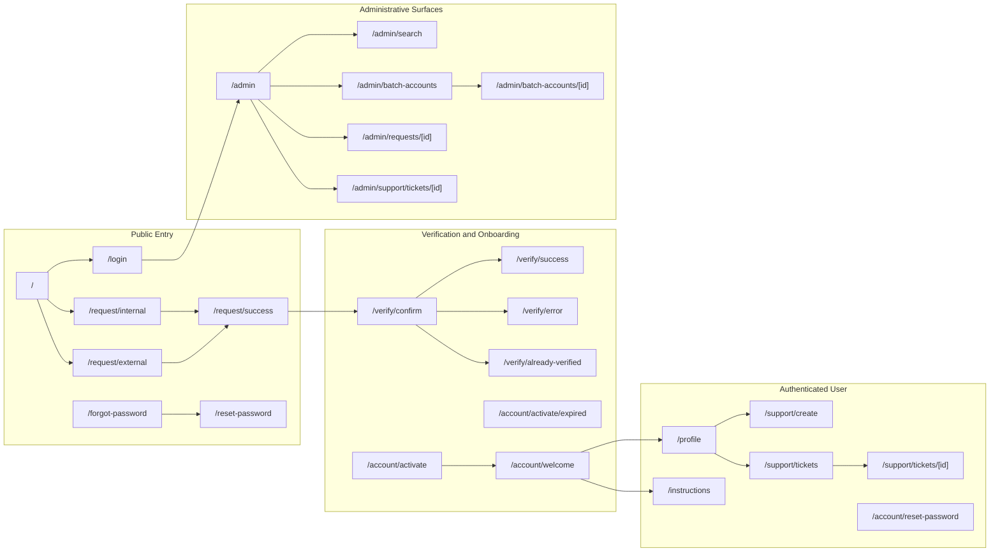
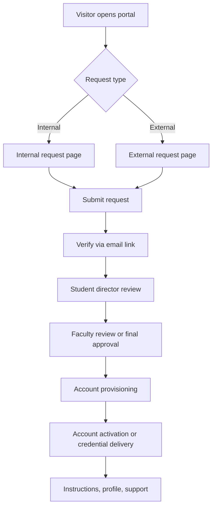
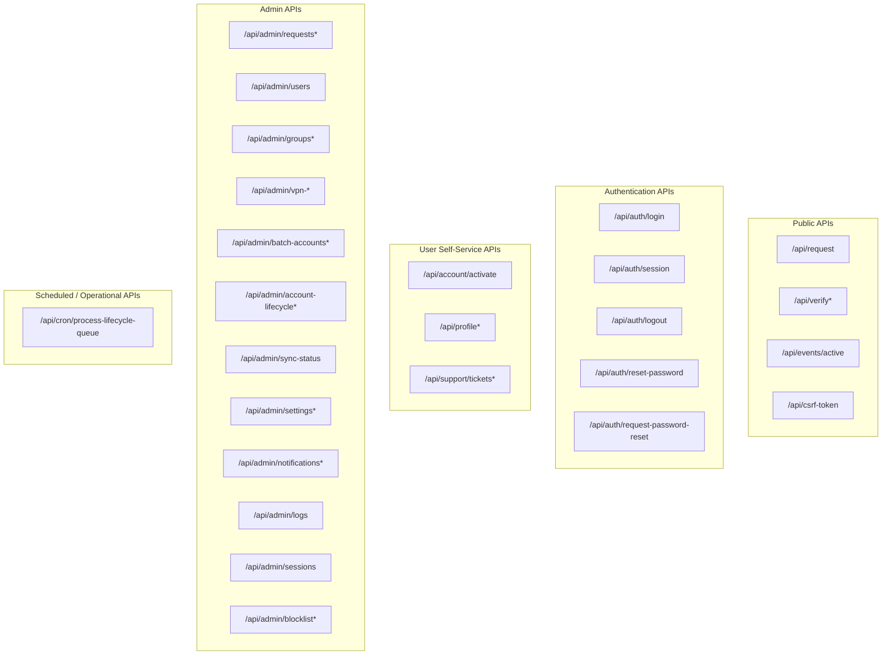
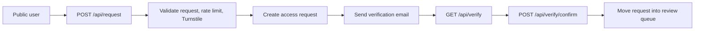
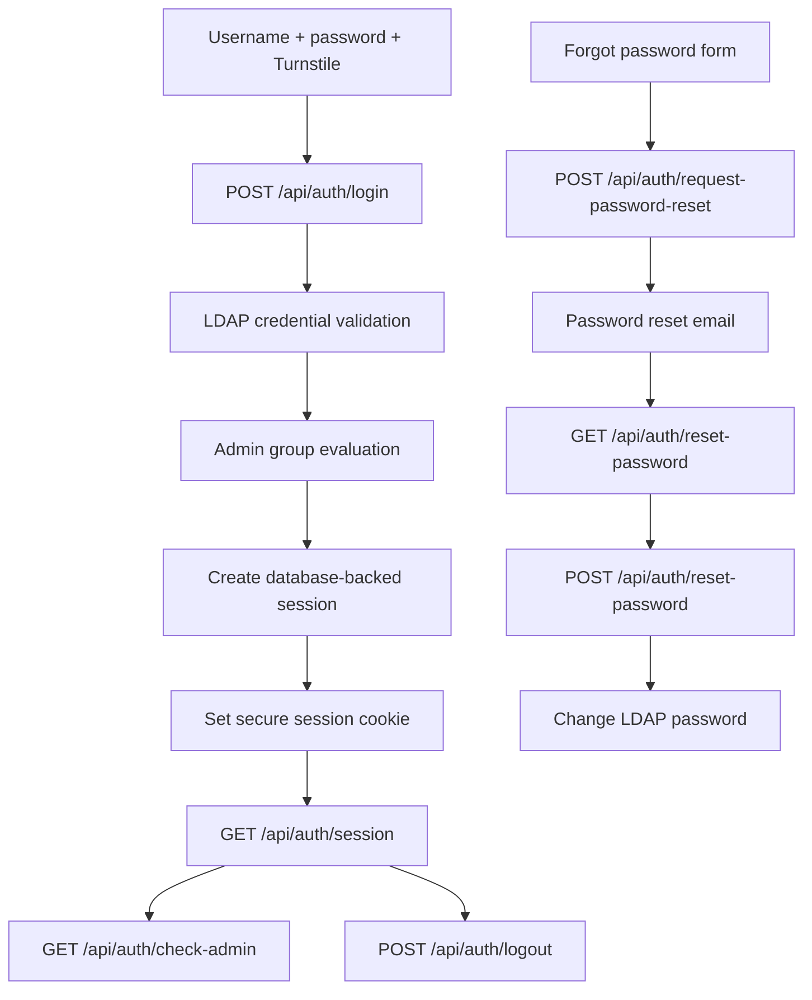
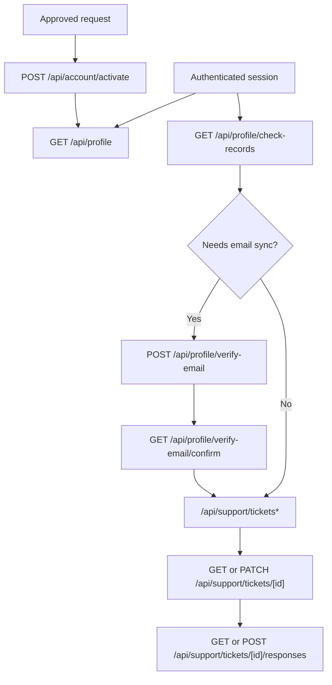
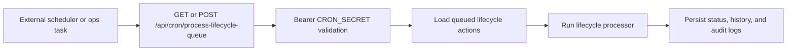

# API and Pages Overview

This document maps the application's user-facing pages, administrative surfaces, and API domains. The goal is not just to list routes, but to show how users and administrators move through the system.

## Pages

### Page Surface Map

### Request and Approval Journey

### Public Pages

| Path | Description |
| :--- | :--- |
| `/` | **Home Page**. Landing page with request paths and login access. |
| `/request/internal` | **Internal Request Form**. Internal requester flow for `@cpp.edu` users. |
| `/request/external` | **External Request Form**. External requester flow for visitors and event users. |
| `/request/success` | **Request Success**. Confirmation page shown after request submission. |
| `/login` | **Admin Login**. LDAP-backed sign-in page protected by Turnstile. |
| `/forgot-password` | **Forgot Password**. Public password reset request form. |
| `/reset-password` | **Reset Password**. Password reset form for token-based recovery. |
| `/instructions` | **Instructions**. VPN and onboarding instructions for authenticated users. |

### Verification and Onboarding Pages

| Path | Description |
| :--- | :--- |
| `/verify/confirm` | **Confirm Verification**. Verification landing page that requires user interaction. |
| `/verify/success` | **Verification Success**. Confirms the request email has been verified. |
| `/verify/error` | **Verification Error**. Invalid, expired, or failed verification path. |
| `/verify/already-verified` | **Already Verified**. Handles duplicate verification attempts safely. |
| `/account/activate` | **Activate Account**. First-time password setup for approved internal users. |
| `/account/activate/expired` | **Activation Expired**. Handles expired onboarding tokens. |
| `/account/welcome` | **Welcome Page**. Post-approval landing page for newly onboarded users. |

### Authenticated User Pages

| Path | Description |
| :--- | :--- |
| `/profile` | **User Profile**. Reads account details from the active LDAP-backed session. |
| `/support/create` | **Create Ticket**. Opens a new support request. |
| `/support/tickets` | **My Tickets**. Lists support requests created by the current user. |
| `/support/tickets/[id]` | **Ticket Detail**. Shows a single ticket thread and status history. |
| `/account/reset-password` | **Authenticated Password Change**. User-facing password management entry point. |

### Admin Pages

Most administrative work happens inside the `/admin` dashboard tabs rather than standalone route trees.

| Path | Description |
| :--- | :--- |
| `/admin` | **Dashboard Home**. Main operations console containing request, account, lifecycle, and governance tabs. |
| `/admin/search` | **Global Search**. Cross-domain lookup for requests, users, and related records. |
| `/admin/batch-accounts` | **Batch Operations**. Bulk account creation workspace. |
| `/admin/batch-accounts/[id]` | **Batch Detail**. Status and results for a single batch run. |
| `/admin/requests/[id]` | **Request Detail**. Detailed view of a single access request. |
| `/admin/support/tickets/[id]` | **Admin Ticket Detail**. Staff-focused support ticket view. |

## 🔌 API Endpoints

### API Domain Map

### Public API

#### Public Request and Verification Flow

| Method | Path | Description |
| :--- | :--- | :--- |
| `POST` | `/api/request` | Submit an internal or external access request. |
| `GET` | `/api/verify` | Resolve a raw email verification link into the verification UI flow. |
| `POST` | `/api/verify/confirm` | Confirm a verification token and transition the request into review. |
| `GET` | `/api/events/active` | Return active events for the external request experience. |
| `GET` | `/api/csrf-token` | Issue a fresh CSRF token for client-side mutating requests. |

### Authentication API

#### Authentication and Session Lifecycle

| Method | Path | Description |
| :--- | :--- | :--- |
| `POST` | `/api/auth/login` | Authenticate a user against LDAP and establish a portal session. |
| `POST` | `/api/auth/logout` | Destroy the current session cookie and invalidate the session row. |
| `GET` | `/api/auth/session` | Return the current session state for the browser. |
| `GET` | `/api/auth/check-admin` | Verify whether the current session has administrative privileges. |
| `POST` | `/api/auth/request-password-reset` | Create and email a password reset token. |
| `GET` | `/api/auth/reset-password` | Validate whether a password reset token is still usable. |
| `POST` | `/api/auth/reset-password` | Apply a password reset by changing the LDAP password. |

### Admin API (`/api/admin/*`)

Protected endpoints require an authenticated admin session and rate-limit checks.

#### Admin Operations Map

```mermaid
flowchart TB
    Dashboard["Admin dashboard"] --> Requests["Request review"]
    Dashboard --> Events["Event management"]
    Dashboard --> Directory["Directory and account ops"]
    Dashboard --> Vpn["VPN and import ops"]
    Dashboard --> Batch["Batch provisioning"]
    Dashboard --> Lifecycle["Lifecycle scheduling"]
    Dashboard --> Support["Support queue"]
    Dashboard --> Governance["Governance and monitoring"]

    Requests --> RequestsRoutes["/api/admin/requests*"]
    Events --> EventsRoutes["/api/admin/events*"]
    Directory --> UsersRoutes["/api/admin/users, /groups*, /ad-search, /ad-comments*"]
    Vpn --> VpnRoutes["/api/admin/vpn-accounts*, /vpn-import*"]
    Batch --> BatchRoutes["/api/admin/batch-accounts*"]
    Lifecycle --> LifecycleRoutes["/api/admin/account-lifecycle*"]
    Lifecycle --> SyncRoutes["/api/admin/sync-status"]
    Support --> SupportRoutes["/api/admin/support/tickets"]
    Governance --> SettingsRoutes["/api/admin/settings*, /notifications*"]
    Governance --> BlocklistRoutes["/api/admin/blocklist*"]
    Governance --> SessionRoutes["/api/admin/sessions"]
    Governance --> LogsRoutes["/api/admin/logs, /track-view"]
```

#### Request Review and Provisioning

| Route Group | Purpose |
| :--- | :--- |
| `/api/admin/requests` | List, filter, and search request records. |
| `/api/admin/requests/[id]` | Read a specific request. |
| `/api/admin/requests/[id]/acknowledge` | Mark a request as acknowledged by staff. |
| `/api/admin/requests/[id]/approve` | Advance or approve a request. |
| `/api/admin/requests/[id]/reject` | Reject a request. |
| `/api/admin/requests/[id]/send-to-faculty` | Move a request into faculty review. |
| `/api/admin/requests/[id]/return-to-faculty` | Return or reroute a request. |
| `/api/admin/requests/[id]/create-account` | Provision an account from a request. |
| `/api/admin/requests/[id]/save-credentials` | Save or update generated credential material. |
| `/api/admin/requests/[id]/manual-assign` | Link a request to an existing account. |
| `/api/admin/requests/[id]/comments` | Read or write request comments. |
| `/api/admin/requests/[id]/resend-*` | Resend verification, activation, or notification emails. |
| `/api/admin/requests/[id]/reset-password` | Trigger a reset path for an approved request. |

#### Directory, VPN, and Account Operations

| Route Group | Purpose |
| :--- | :--- |
| `/api/admin/users` | Search and inspect LDAP-backed users. |
| `/api/admin/groups` and `/api/admin/groups/[groupName]/members` | Discover groups and manage membership. |
| `/api/admin/ad-search` | Dedicated directory search endpoint. |
| `/api/admin/ad-comments*` | Store and manage AD-linked comments. |
| `/api/admin/vpn-accounts` and `/api/admin/vpn-accounts/[id]*` | CRUD and status operations for VPN accounts. |
| `/api/admin/vpn-import*` | Upload, inspect, match, process, clean up, and clear import batches. |
| `/api/admin/check-username` | Validate username availability before provisioning. |
| `/api/admin/generate-password` | Generate strong passwords for operational workflows. |

#### Batch, Lifecycle, and Synchronization

| Route Group | Purpose |
| :--- | :--- |
| `/api/admin/batch-accounts` | List and create batch provisioning jobs. |
| `/api/admin/batch-accounts/create` | Run bulk account creation from uploaded/admin-entered data. |
| `/api/admin/batch-accounts/[id]` | Inspect batch job details. |
| `/api/admin/batch-accounts/[id]/cancel` | Cancel an in-flight batch. |
| `/api/admin/batch-accounts/cleanup` | Clean stale batch data. |
| `/api/admin/account-lifecycle` | Create and list lifecycle actions. |
| `/api/admin/account-lifecycle/[id]*` | Inspect, retry, cancel, or update a specific lifecycle action. |
| `/api/admin/account-lifecycle/batch` | Submit grouped lifecycle operations. |
| `/api/admin/account-lifecycle/process` | Manually trigger lifecycle processing. |
| `/api/admin/sync-status` | View AD/VPN/request reconciliation status. |
| `/api/admin/settings/infrastructure-sync` | Run or inspect infrastructure backfill/sync jobs. |

#### Governance, Monitoring, and Configuration

| Route Group | Purpose |
| :--- | :--- |
| `/api/admin/settings` | Read and update system-wide operational settings. |
| `/api/admin/notifications*` | Manage UI notification banners. |
| `/api/admin/blocklist*` | Manage blocked email records. |
| `/api/admin/logs` | Read audit history. |
| `/api/admin/sessions` | Inspect active sessions or revoke selected sessions. |
| `/api/admin/support/tickets` | Staff-facing ticket queue management. |
| `/api/admin/search` | Cross-system search. |
| `/api/admin/track-view` | Track admin page views for auditing. |
| `/api/admin/logout` | Explicit admin logout endpoint. |
| `/api/admin/cleanup-passwords` | Remove stale stored temporary passwords. |

### User API

#### User Self-Service Flow

| Method | Path | Description |
| :--- | :--- | :--- |
| `POST` | `/api/account/activate` | Complete initial account activation with a token and new password. |
| `GET` | `/api/profile` | Fetch the current user profile from the active session. |
| `GET` | `/api/profile/check-records` | Determine whether the logged-in user needs email or record reconciliation. |
| `POST` | `/api/profile/verify-email` | Start email verification for grandfathered/internal account reconciliation. |
| `GET` | `/api/profile/verify-email/confirm` | Confirm grandfathered-account email verification and sync AD data. |
| `GET` | `/api/support/tickets` | List tickets for the current user. |
| `POST` | `/api/support/tickets` | Create a new support ticket. |
| `GET` | `/api/support/tickets/[id]` | Read a specific support ticket. |
| `PATCH` | `/api/support/tickets/[id]` | Update ticket status where allowed. |
| `GET` | `/api/support/tickets/[id]/responses` | Read ticket responses. |
| `POST` | `/api/support/tickets/[id]/responses` | Add a response to a ticket thread. |

### Scheduled and Operational API

#### Lifecycle Queue Processing

| Method | Path | Description |
| :--- | :--- | :--- |
| `GET` | `/api/cron/process-lifecycle-queue` | Scheduled processing of queued lifecycle actions. |
| `POST` | `/api/cron/process-lifecycle-queue` | Manual or compatible alternate trigger for the same queue processor. |
