# UAR Web 2: Complete Application Overview

> **Mitchell C. Hill Student Data Center - User Access Request Portal**  
> Cal Poly Pomona Student SOC  
> Comprehensive Technical Documentation

---

## Table of Contents

1. [Executive Summary](#executive-summary)
2. [System Architecture](#system-architecture)
3. [Technology Stack](#technology-stack)
4. [Infrastructure & Deployment](#infrastructure--deployment)
5. [Database Architecture](#database-architecture)
6. [Security Architecture](#security-architecture)
7. [User Workflows](#user-workflows)
8. [Feature Catalog](#feature-catalog)
9. [API Documentation](#api-documentation)
10. [Admin Dashboard Components](#admin-dashboard-components)
11. [Integration Points](#integration-points)
12. [Data Flow Diagrams](#data-flow-diagrams)

---

## Executive Summary

The UAR (User Access Request) Portal is a modern, enterprise-grade web application built to manage access requests for the Mitchell C. Hill Student Data Center at Cal Poly Pomona. The system manages the entire lifecycle of user access from initial request through provisioning, management, and eventual deactivation.

**Key Statistics:**
- **87 React Components** (TSX)
- **83 API Endpoints**
- **31 Database Models** (Prisma ORM)
- **12 Admin Dashboard Tabs**
- **23 Admin API Categories**

---

## System Architecture

### High-Level Architecture

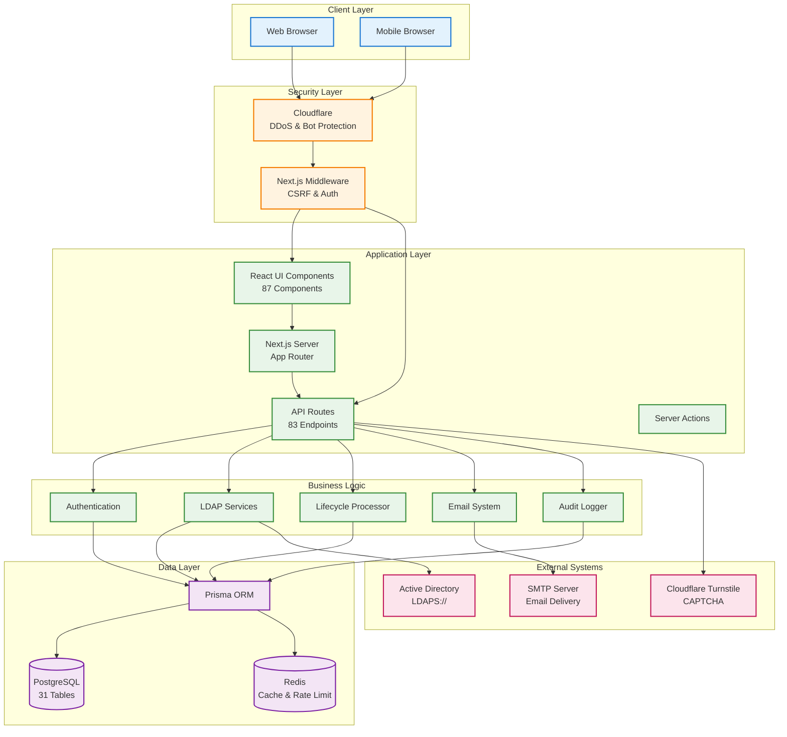

### Application Layers

| Layer | Components | Purpose |
|-------|-----------|---------|
| **Presentation** | React Components, Tailwind CSS, Shadcn UI | User interface and interaction |
| **API** | Next.js API Routes (83 endpoints) | RESTful backend services |
| **Business Logic** | LDAP services, Lifecycle processor, Email system | Core application functionality |
| **Data Access** | Prisma ORM | Database abstraction and queries |
| **Persistence** | PostgreSQL, Redis | Data storage and caching |
| **Integration** | Active Directory, SMTP, Cloudflare Turnstile | External system connections |

---

## Technology Stack

### Core Framework
```json
{
  "framework": "Next.js 16.0.8 (App Router)",
  "runtime": "React 19.2.1",
  "language": "TypeScript 5.9.3"
}
```

### UI & Styling
- **CSS Framework**: Tailwind CSS v4
- **Component Library**: Shadcn UI (Radix UI primitives)
- **Icons**: Lucide React
- **Animations**: Framer Motion
- **Theming**: next-themes (dark mode support)

### Database & ORM
- **Database**: PostgreSQL 16
- **ORM**: Prisma 7.0.0
- **Caching**: Redis (@upstash/redis)
- **Adapter**: @prisma/adapter-pg

### Authentication & Security
- **Authentication**: Custom session-based (HTTP-only cookies)
- **CSRF Protection**: csrf-csrf library
- **Password Hashing**: bcryptjs
- **Token Generation**: nanoid
- **CAPTCHA**: Cloudflare Turnstile (react-turnstile)
- **LDAP**: ldapts (LDAPS support)

### Email & Notifications
- **Email**: Nodemailer
- **Notifications**: Sonner (toast notifications)
- **Logging**: Winston

---

## Infrastructure & Deployment

### Docker Compose Architecture

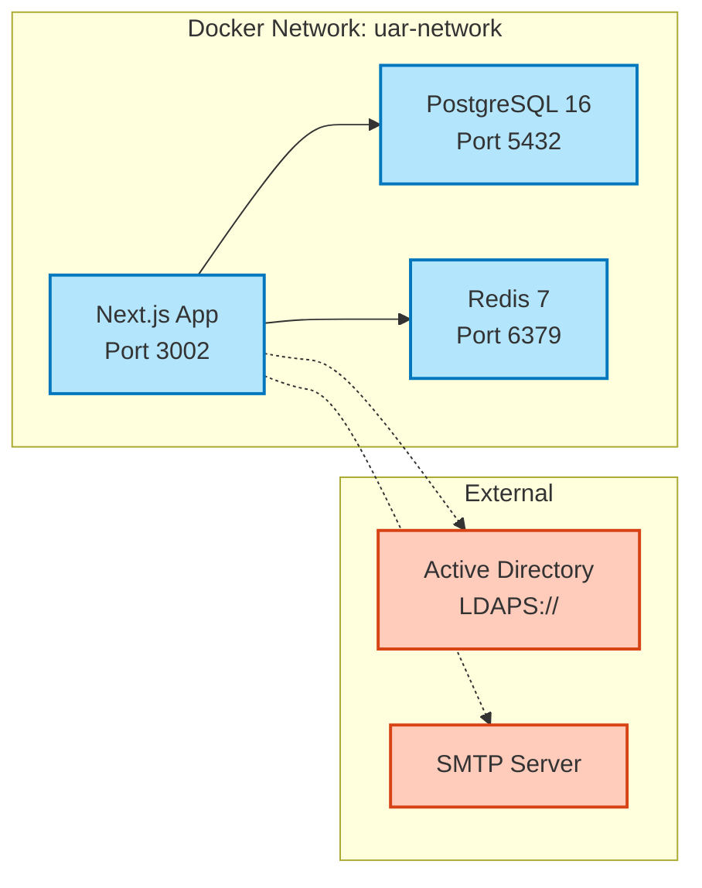

### Container Configuration

| Service | Image | Exposed Port | Health Check | Volumes |
|---------|-------|-------------|-------------|---------|
| **app** | uar-web:latest | 3002 | N/A | None |
| **postgres** | postgres:16-alpine | 5432 | pg_isready | postgres_data |
| **redis** | redis:7-alpine | 6379 | redis-cli ping | redis_data |

### Environment Variables (33 total)

**Database:**
- `DATABASE_URL` - PostgreSQL connection string
- `REDIS_URL` - Redis connection URL

**LDAP/Active Directory:**
- `LDAP_URL`, `LDAP_BIND_DN`, `LDAP_BIND_PASSWORD`
- `LDAP_BASE`, `LDAP_SEARCH_BASE`, `LDAP_DOMAIN`
- `LDAP_ADMIN_GROUPS`, `LDAP_GROUP2ADD`

**Email:**
- `SMTP_HOST`, `SMTP_PORT`, `SMTP_USER`, `SMTP_PASSWORD`
- `EMAIL_FROM`, `ADMIN_EMAIL`

**Security:**
- `NEXTAUTH_SECRET`, `ENCRYPTION_SECRET`, `ENCRYPTION_SALT`
- `TURNSTILE_SECRET_KEY`, `NEXT_PUBLIC_TURNSTILE_SITE_KEY`

---

## Database Architecture

### Entity Relationship Diagram

```mermaid
erDiagram
    AccessRequest ||--o{ RequestComment : has
    AccessRequest ||--o| AccountActivationToken : "verified via"
    AccessRequest ||--o{ SupportTicket : "related to"
    AccessRequest }o--o| Event : "attends"
    AccessRequest ||--o{ ADAccountComment : "has comments"
    
    Event ||--o{ AccessRequest : includes
    
    SupportTicket ||--o{ TicketResponse : responses
    SupportTicket ||--o{ TicketStatusLog : "status history"
    SupportTicket ||--o{ BatchAccountCreation : "linked to"
    
    BatchAccountCreation ||--o{ BatchAccountItem : contains
    BatchAccountCreation ||--o{ BatchAuditLog : "audit trail"
    
    VPNAccount ||--o{ VPNAccountStatusLog : "status history"
    VPNAccount ||--o{ VPNAccountComment : comments
    VPNAccount ||--o{ VPNAccountActivityLog : activity
    
    VPNImport ||--o{ VPNImportRecord : records
    
    AccountLifecycleBatch ||--o{ AccountLifecycleAction : actions
    AccountLifecycleAction ||--o{ AccountLifecycleHistory : history
    AccountLifecycleAction ||--o{ ADAccountActivityLog : "AD activity"
    AccountLifecycleAction ||--o{ VPNAccountActivityLog : "VPN activity"
    
    ADAccountSync ||--o{ ADAccountMatch : matches
    
    Session {
        string tokenHash PK
        string username
        boolean isAdmin
        datetime expiresAt
        datetime lastActivity
        string ipAddress
        string userAgent
    }
    
    AuditLog {
        string id PK
        string action
        string category
        string username
        string targetId
        json details
        datetime createdAt
    }
    
    SystemSettings {
        boolean loginDisabled
        boolean internalRegistrationDisabled
        boolean externalRegistrationDisabled
        string emailFrom
        string adminEmail
        string facultyEmail
    }
    
    NotificationBanner {
        string message
        string type
        int priority
        boolean isActive
        datetime startDate
        datetime endDate
    }
    
    BlockedEmail {
        string email
        string reason
        boolean isActive
        string blockedBy
    }
```

### Database Models (31 Total)

#### Core Models
1. **AccessRequest** - Main access request lifecycle
2. **RequestComment** - Comments on requests
3. **Event** - Events (conferences, workshops)
4. **Session** - User sessions

#### Account Management
5. **VPNAccount** - VPN-only accounts (external users)
6. **VPNAccountStatusLog** - VPN status history
7. **VPNAccountComment** - VPN account notes
8. **VPNAccountActivityLog** - VPN activity tracking
9. **ADAccountComment** - Active Directory account notes
10. **ADAccountActivityLog** - AD activity tracking

#### Lifecycle Management
11. **AccountLifecycleAction** - Disable/enable/revoke actions
12. **AccountLifecycleBatch** - Batch lifecycle operations
13. **AccountLifecycleHistory** - Lifecycle event history
14. **VPNRoleChange** - VPN role promotion/demotion

#### Batch Operations
15. **BatchAccountCreation** - Batch account creation jobs
16. **BatchAccountItem** - Individual batch items
17. **BatchAuditLog** - Batch operation audit trail

#### VPN Import
18. **VPNImport** - VPN spreadsheet imports
19. **VPNImportRecord** - Individual import records

#### Synchronization
20. **ADAccountSync** - AD synchronization runs
21. **ADAccountMatch** - AD-VPN matching results

#### Support System
22. **SupportTicket** - User support tickets
23. **TicketResponse** - Ticket responses
24. **TicketStatusLog** - Ticket status history

#### Security & Tokens
25. **PasswordResetToken** - Password reset tokens
26. **AccountActivationToken** - Account activation tokens
27. **BlockedEmail** - Email blocklist

#### System Configuration
28. **SystemSettings** - Global system settings
29. **NotificationBanner** - System-wide notifications
30. **AuditLog** - Comprehensive audit logging

---

## Security Architecture

### Multi-Layer Security Model

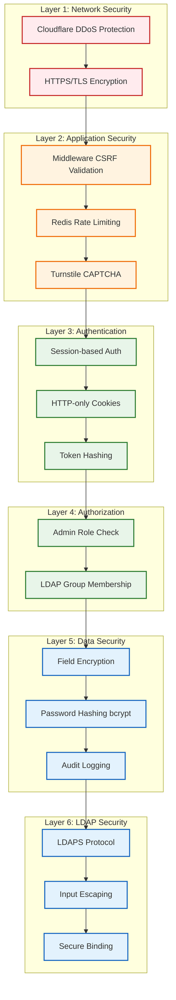

### Security Features

#### 1. CSRF Protection
- **Implementation**: `csrf-csrf` library
- **Token Storage**: HTTP-only cookies
- **Validation**: Middleware-level for all mutating requests
- **Rotation**: 8-hour token lifetime with automatic rotation

#### 2. Session Management
- **Type**: Custom session-based (not JWT)
- **Storage**: PostgreSQL database
- **Cookies**: HTTP-only, Secure, SameSite=Strict
- **Expiration**: Configurable (default: 7 days)
- **Features**:
  - IP address tracking
  - User agent tracking
  - Last activity timestamp
  - Manual revocation support

#### 3. Rate Limiting
- **Backend**: Redis sliding window
- **Limits**:
  - Login: 5 attempts per 15 minutes
  - Request submission: 3 per hour
  - Password reset: 3 per hour
  - API endpoints: 100 per minute (admin)

#### 4. Input Validation
- **Library**: Zod schemas
- **Validation Points**:
  - All API route inputs
  - Form submissions
  - LDAP query parameters (escaped)

#### 5. Password Security
- **Hashing**: bcryptjs (salt rounds: 12)
- **Policies**:
  - Minimum 12 characters
  - Must include uppercase, lowercase, number, special char
- **Storage**: Encrypted in database for temporary accounts
- **Reset**: Time-limited tokens (1 hour)

#### 6. LDAP Security
- **Protocol**: LDAPS (LDAP over SSL/TLS)
- **Binding**: Service account with least privilege
- **Input Sanitization**: All LDAP queries use escaped inputs
- **Error Handling**: Generic error messages (prevent enumeration)

#### 7. Audit Logging
- **Coverage**: All admin actions, page views, data modifications
- **Storage**: Immutable `AuditLog` table
- **Fields**: Action, category, username, target, details (JSON), IP, user agent
- **Retention**: Permanent (no auto-deletion)

---

## User Workflows

### 1. Access Request Workflow (Primary)

```mermaid
stateDiagram-v2
    [*] --> SelectType: User visits portal
    
    state SelectType {
        [*] --> Internal: Has @cpp.edu
        [*] --> External: Non-CPP email
    }
    
    SelectType --> FillForm: Choose type
    
    state FillForm {
        [*] --> BasicInfo
        BasicInfo --> DomainChoice: Internal only
        BasicInfo --> EventInfo: External only
        DomainChoice --> Captcha: External users
        EventInfo --> Captcha
    }
    
    FillForm --> Submitted: Submit form
    Submitted --> EmailSent: System sends verification
    EmailSent --> Verifying: User checks email
    
    state Verifying {
        [*] --> ClickLink
        ClickLink --> TokenValid: Validate token
        TokenValid --> Verified
    }
    
    Verified --> DirectorNotified: Auto-notify directors
    DirectorNotified --> DirectorReview
    
    state DirectorReview {
        [*] --> PendingDirector
        PendingDirector --> DirectorAcknowledged: Director acknowledges
    }
    
    DirectorAcknowledged --> FacultyNotified: Admin sends to faculty
    FacultyNotified --> FacultyReview
    
    state FacultyReview {
        [*] --> PendingFaculty
        PendingFaculty --> Approved: Faculty approves
        PendingFaculty --> Rejected: Faculty rejects
    }
    
    Approved --> Provisioning: Admin provisions
    
    state Provisioning {
        [*] --> CreateAD: needsDomainAccount=true
        [*] --> CreateVPN: needsDomainAccount=false
        CreateAD --> SetPassword
        CreateVPN --> SetPassword
        SetPassword --> SetExpiration
        SetExpiration --> Done
    }
    
    Provisioning --> AccountCreated: Accounts created
    AccountCreated --> UserNotified: Email with credentials
    UserNotified --> [*]
    
    Rejected --> UserNotified
```

### 2. Admin Account Management Workflow

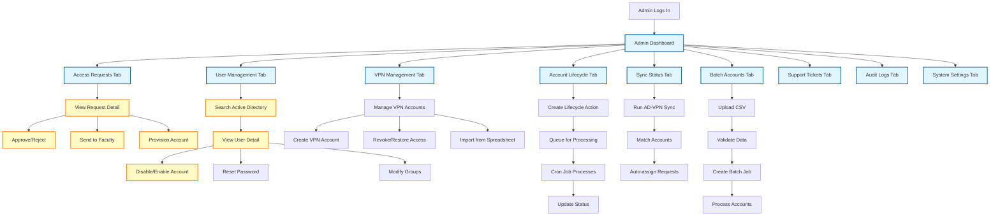

### 3. Support Ticket Workflow

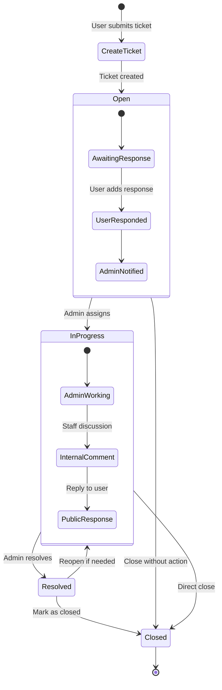

---

## Feature Catalog

### Public Features (Unauthenticated)

| Feature | Route | Description | CAPTCHA Required |
|---------|-------|-------------|------------------|
| **Home Page** | `/` | Landing page with request type selection | No |
| **Internal Request** | `/request/internal` | Access request for @cpp.edu students | No |
| **External Request** | `/request/external` | Access request for non-CPP users | Yes |
| **Email Verification** | `/verify?token=...` | Verify email via link | No |
| **Account Activation** | `/account?token=...` | Initial account setup | No |
| **Login** | `/login` | Admin/user login | No |
| **Password Reset Request** | `/forgot-password` | Request password reset | Yes |
| **Password Reset** | `/reset-password?token=...` | Reset password with token | No |
| **VPN Instructions** | `/instructions` | View VPN setup instructions (auth) | No |

### Authenticated User Features

| Feature | Route | Description |
|---------|-------|-------------|
| **User Profile** | `/profile` | View and update profile |
| **Support Tickets** | `/support/tickets` | View own tickets |
| **Create Ticket** | `/support/create` | Submit support ticket |
| **Ticket Detail** | `/support/tickets/[id]` | View ticket thread |

### Admin Features (12 Tabs)

#### Tab 1: Access Requests
- View all requests with filterable status
- Kanban-style or list view
- Quick actions: Approve, Reject, Send to Faculty
- Detailed modal with full history
- Comments and internal notes
- Status progression: Pending Verification → Director Review → Faculty Review → Approved/Rejected

#### Tab 2: Events Management
- Create and manage events
- Link requests to events
- Set event end dates
- Deactivate events

#### Tab 3: User Management (Active Directory)
- Search AD users by username, email, or name
- View user details: groups, attributes, account status
- Enable/disable accounts
- Reset passwords
- Modify group memberships
- View account expiration dates

#### Tab 4: VPN Management
- Manage VPN-only accounts (external users)
- Filter by portal type: Management, Limited, External
- Bulk operations: Revoke, Restore, Status change
- Import from spreadsheet (CSV/Excel)
- Match VPN accounts to AD accounts
- Comments and status history

#### Tab 5: Account Lifecycle
- Queue disable/enable actions for AD accounts
- Queue revoke/restore actions for VPN accounts
- VPN role promotion/demotion (Limited ↔ Management)
- Batch lifecycle operations
- View action queue and history
- Manual retry/cancel

#### Tab 6: Account Sync Status
- View AD-VPN synchronization status
- Run manual sync operations
- See matched/unmatched accounts
- Auto-assign requests to existing accounts
- Identify orphaned accounts

#### Tab 7: Batch Accounts
- Create batch AD account creation jobs
- Upload CSV with account data
- Link batch to support ticket
- Progress tracking
- Error reporting per account
- Audit trail

#### Tab 8: Support Tickets
- View all support tickets
- Filter by status, category, severity
- Internal staff comments
- Public responses
- Status management: Open → In Progress → Resolved → Closed
- Link tickets to access requests

#### Tab 9: Blocklist
- Block emails or domains
- Prevent repeat requesters
- Deactivate/reactivate blocks
- Link to support tickets

#### Tab 10: System Settings
- Disable login globally
- Disable internal/external registration
- Email configuration
- Faculty and director email lists
- Notification banners
- Infrastructure sync controls

#### Tab 11: Audit Logs
- View all admin actions
- Filter by action type, category, username
- Search by target ID
- View detailed JSON payload
- Export logs

#### Tab 12: Session Management
- View active sessions
- Revoke sessions manually
- See IP addresses and user agents
- Last activity timestamps

### Additional Admin Features

- **Global Search** (`/admin/search`) - Search across requests, users, VPN accounts
- **Batch Operations** - Bulk enable/disable, status changes
- **Live Updates** - Auto-refresh with `usePolling` hook (configurable interval)
- **Dark Mode** - Full dark mode support across all tabs

---

## API Documentation

### API Route Structure (83 Endpoints)

#### Public API Routes

**Authentication**
- `POST /api/auth/login` - Admin/user login
- `POST /api/auth/logout` - Logout and destroy session
- `GET /api/auth/session` - Check session status
- `POST /api/auth/request-password-reset` - Request password reset
- `POST /api/auth/reset-password` - Reset password with token
- `GET /api/auth/check-admin` - Check if user is admin

**Access Requests**
- `POST /api/request` - Submit access request

**Email Verification**
- `POST /api/verify` - Resend verification email
- `POST /api/verify/confirm` - Confirm email verification

**Events**
- `GET /api/events/active` - Get active events

**User Profile**
- `GET /api/profile` - Get user profile (authenticated)
- `PUT /api/profile` - Update user profile
- `POST /api/profile/verify-email` - Request email verification
- `POST /api/profile/verify-email/confirm` - Confirm email change
- `GET /api/profile/check-records` - Check for existing requests

**Support**
- `GET /api/support/tickets` - Get user's tickets (authenticated)
- `POST /api/support/tickets` - Create support ticket
- `GET /api/support/tickets/[id]` - Get ticket detail
- `POST /api/support/tickets/[id]/responses` - Add ticket response

**Account Activation**
- `POST /api/account` - Activate account with token

**CSRF**
- `GET /api/csrf-token` - Get CSRF token

**System Settings**
- `GET /api/settings/banner` - Get active notification banners

**Cron Jobs**
- `POST /api/cron/process-lifecycle-queue` - Process lifecycle actions (cron only)

#### Admin API Routes (Protected)

**Access Requests Management (17 endpoints)**
- `GET /api/admin/requests` - List all requests
- `GET /api/admin/requests/[id]` - Get request detail
- `PUT /api/admin/requests/[id]` - Update request
- `DELETE /api/admin/requests/[id]` - Delete request
- `POST /api/admin/requests/[id]/notify-faculty` - Send to faculty
- `POST /api/admin/requests/[id]/undo-notify-faculty` - Undo faculty notification
- `POST /api/admin/requests/[id]/send-to-faculty` - Forward to faculty
- `POST /api/admin/requests/[id]/approve` - Approve request
- `POST /api/admin/requests/[id]/reject` - Reject request
- `POST /api/admin/requests/[id]/move-back` - Move back in workflow
- `POST /api/admin/requests/[id]/save-credentials` - Save provisioned credentials
- `POST /api/admin/requests/[id]/reveal-password` - Reveal account password
- `POST /api/admin/requests/[id]/update-account` - Update account info
- `POST /api/admin/requests/[id]/resend-verification` - Resend verification email
- `POST /api/admin/requests/[id]/resend-notification` - Resend notification
- `POST /api/admin/requests/[id]/acknowledge` - Director acknowledgment
- `POST /api/admin/requests/[id]/comment` - Add comment

**Events Management**
- `GET /api/admin/events` - List all events
- `POST /api/admin/events` - Create event
- `PUT /api/admin/events/[id]` - Update event
- `DELETE /api/admin/events/[id]` - Delete event

**User Management (Active Directory)**
- `GET /api/admin/users` - Search AD users
- `GET /api/admin/users/[username]` - Get user detail
- `POST /api/admin/users/disable` - Disable AD account
- `POST /api/admin/users/enable` - Enable AD account
- `POST /api/admin/users/reset-password` - Reset AD password

**VPN Accounts Management (5 endpoints)**
- `GET /api/admin/vpn-accounts` - List VPN accounts
- `POST /api/admin/vpn-accounts` - Create VPN account
- `GET /api/admin/vpn-accounts/[id]` - Get VPN account detail
- `PUT /api/admin/vpn-accounts/[id]` - Update VPN account
- `DELETE /api/admin/vpn-accounts/[id]` - Delete VPN account
- `POST /api/admin/vpn-accounts/[id]/status` - Change VPN status
- `POST /api/admin/vpn-accounts/[id]/comments` - Add comment
- `POST /api/admin/vpn-accounts/bulk-status` - Bulk status change

**VPN Import (6 endpoints)**
- `GET /api/admin/vpn-import` - List imports
- `POST /api/admin/vpn-import` - Create import
- `GET /api/admin/vpn-import/[id]` - Get import detail
- `POST /api/admin/vpn-import/match` - Match records to AD
- `POST /api/admin/vpn-import/process` - Process import
- `POST /api/admin/vpn-import/cleanup` - Cleanup old imports
- `POST /api/admin/vpn-import/clear` - Clear import

**Account Lifecycle (6 endpoints)**
- `GET /api/admin/account-lifecycle` - List lifecycle actions
- `POST /api/admin/account-lifecycle` - Create lifecycle action
- `GET /api/admin/account-lifecycle/[id]` - Get action detail
- `PUT /api/admin/account-lifecycle/[id]` - Update action
- `DELETE /api/admin/account-lifecycle/[id]` - Cancel action
- `POST /api/admin/account-lifecycle/process` - Process queued actions

**Batch Accounts (4 endpoints)**
- `GET /api/admin/batch-accounts` - List batch jobs
- `POST /api/admin/batch-accounts` - Create batch job
- `GET /api/admin/batch-accounts/[id]` - Get batch detail
- `POST /api/admin/batch-accounts/[id]/retry` - Retry failed accounts

**Support Tickets**
- `GET /api/admin/support/tickets` - List all tickets
- `PUT /api/admin/support/tickets/[id]` - Update ticket status
- `POST /api/admin/support/tickets/[id]/response` - Add staff response

**Blocklist**
- `GET /api/admin/blocklist` - List blocked emails
- `POST /api/admin/blocklist` - Block email
- `DELETE /api/admin/blocklist/[id]` - Unblock email

**System Settings**
- `GET /api/admin/settings` - Get system settings
- `PUT /api/admin/settings` - Update system settings
- `POST /api/admin/settings/infrastructure-sync` - Run infrastructure sync

**Notifications**
- `GET /api/admin/notifications` - List notification banners
- `POST /api/admin/notifications` - Create banner
- `PUT /api/admin/notifications/[id]` - Update banner
- `DELETE /api/admin/notifications/[id]` - Delete banner

**Groups & AD Management**
- `GET /api/admin/groups` - List AD groups
- `POST /api/admin/groups/add-member` - Add user to group
- `POST /api/admin/groups/remove-member` - Remove user from group

**Search**
- `GET /api/admin/search` - Global search
- `GET /api/admin/ad-search` - Active Directory search

**Audit Logs**
- `GET /api/admin/logs` - Get audit logs (paginated)

**Sessions**
- `GET /api/admin/sessions` - List active sessions
- `DELETE /api/admin/sessions/[id]` - Revoke session

**Sync Status**
- `GET /api/admin/sync-status` - Get AD-VPN sync status

**Utilities**
- `POST /api/admin/track-view` - Track admin page view
- `GET /api/admin/generate-password` - Generate secure password
- `POST /api/admin/check-username` - Check username availability
- `POST /api/admin/cleanup-passwords` - Cleanup expired passwords (cron)
- `POST /api/admin/logout` - Admin logout

**Comments**
- `GET /api/admin/ad-comments` - Get AD account comments
- `POST /api/admin/ad-comments` - Add AD account comment

---

## Admin Dashboard Components

### Component Hierarchy

```mermaid
graph TD
    Page[admin/page.tsx<br/>Main Dashboard]
    
    Page --> Tab1[AccessRequestsTab]
    Page --> Tab2[EventManagementTab]
    Page --> Tab3[UserManagementTab]
    Page --> Tab4[VPNManagementTab]
    Page --> Tab5[AccountLifecycleTab]
    Page --> Tab6[AccountSyncStatusTab]
    Page --> Tab7[BatchAccountsTab]
    Page --> Tab8[SupportTicketsTab]
    Page --> Tab9[BlocklistTab]
    Page --> Tab10[SystemSettingsTab]
    Page --> Tab11[LogsTab]
    Page --> Tab12[SessionManagementTab]
    
    Tab1 --> Modal1[RequestDetailModal]
    Tab2 --> Modal2[EventModal]
    Tab3 --> Modal3[UserDetailModal]
    Tab4 --> Modal4[VPNAccountDetailModal]
    Tab4 --> Modal5[VPNImportModal]
    Tab4 --> Modal6[VPNADMatchModal]
    Tab5 --> Modal7[GroupManagementModal]
    Tab7 --> Modal8[BatchDetailModal]
    Tab8 --> Modal9[TicketDetailModal]
    Tab10 --> Modal10[NotificationModal]
    Tab10 --> Panel[InfrastructureSyncPanel]
    
    Tab4 --> SubTab1[VPNAccountsTable]
    Tab4 --> SubTab2[VPNFilterBar]
    Tab4 --> SubTab3[VPNStatsCards]
    Tab4 --> SubTab4[VPNBulkEditModal]
    
    classDef main fill:#e1bee7,stroke:#6a1b9a,stroke-width:3px
    classDef tab fill:#c5e1a5,stroke:#558b2f,stroke-width:2px
    classDef modal fill:#b3e5fc,stroke:#01579b,stroke-width:2px
    
    class Page main
    class Tab1,Tab2,Tab3,Tab4,Tab5,Tab6,Tab7,Tab8,Tab9,Tab10,Tab11,Tab12 tab
    class Modal1,Modal2,Modal3,Modal4,Modal5,Modal6,Modal7,Modal8,Modal9,Modal10 modal
```

### Admin Component Details (24 Components)

| Component | File | Purpose | Modals Used |
|-----------|------|---------|-------------|
| **AccessRequestsTab** | AccessRequestsTab.tsx | Request management with kanban/list view | RequestDetailModal |
| **EventManagementTab** | EventManagementTab.tsx | Create and manage events | EventModal |
| **UserManagementTab** | UserManagementTab.tsx | AD user search and management | UserDetailModal |
| **VPNManagementTab** | VPNManagementTab.tsx | VPN account CRUD operations | VPNAccountDetailModal, VPNImportModal, VPNADMatchModal |
| **AccountLifecycleTab** | AccountLifecycleTab.tsx | Disable/enable/revoke actions | GroupManagementModal |
| **AccountSyncStatusTab** | AccountSyncStatusTab.tsx | AD-VPN sync dashboard | None |
| **BatchAccountsTab** | BatchAccountsTab.tsx | Batch account creation | BatchDetailModal |
| **SupportTicketsTab** | SupportTicketsTab.tsx | Support ticket management | TicketDetailModal |
| **BlocklistTab** | BlocklistTab.tsx | Email blocklist management | None |
| **SystemSettingsTab** | SystemSettingsTab.tsx | Global settings | NotificationModal, InfrastructureSyncPanel |
| **LogsTab** | LogsTab.tsx | Audit log viewer | None |
| **SessionManagementTab** | SessionManagementTab.tsx | Active session management | None |

### Shared Components

| Component | Location | Purpose |
|-----------|----------|---------|
| **Button** | components/ui/button.tsx | Primary button component (Shadcn) |
| **Card** | components/ui/card.tsx | Card container (Shadcn) |
| **Dialog** | components/ui/dialog.tsx | Modal dialog (Shadcn) |
| **Input** | components/ui/input.tsx | Text input (Shadcn) |
| **Select** | components/ui/select.tsx | Dropdown select (Shadcn) |
| **Table** | components/ui/table.tsx | Data table (Shadcn) |
| **Badge** | components/ui/badge.tsx | Status badge (Shadcn) |
| **Alert** | components/ui/alert.tsx | Alert message (Shadcn) |
| **Tabs** | components/ui/tabs.tsx | Tab navigation (Shadcn) |
| **Checkbox** | components/ui/checkbox.tsx | Checkbox input (Shadcn) |
| **Switch** | components/ui/switch.tsx | Toggle switch (Shadcn) |
| **DropdownMenu** | components/ui/dropdown-menu.tsx | Dropdown menu (Shadcn) |
| **Toast** | components/Toast.tsx | Toast notifications (Sonner) |
| **Navbar** | components/Navbar.tsx | Main navigation |
| **Footer** | components/Footer.tsx | Page footer |
| **DatePicker** | components/DatePicker.tsx | Date selection |
| **DateTimePicker** | components/DateTimePicker.tsx | Date and time selection |

---

## Integration Points

### 1. Active Directory (LDAP)

**Connection Details:**
- Protocol: LDAPS (LDAP over SSL/TLS)
- Library: `ldapts`
- Location: `lib/ldap/`

**LDAP Modules** (8 files):

| Module | File | Purpose |
|--------|------|---------|
| **Client** | client.ts | LDAP connection management |
| **User Search** | user-search.ts | Search AD for users |
| **User CRUD** | user-crud.ts | Create, update, delete users |
| **Password** | password.ts | Password reset and management |
| **Attributes** | attributes.ts | Modify user attributes |
| **Groups** | groups.ts | Group membership management |
| **Utils** | utils.ts | LDAP helper functions |
| **Index** | index.ts | Re-export all modules |

**Operations Supported:**
- Search users by username, email, displayName
- Create new AD accounts
- Disable/enable accounts (userAccountControl)
- Reset passwords
- Set account expiration
- Add/remove group memberships
- Modify user attributes (description, mail, etc.)
- Validate credentials

### 2. Email System (SMTP)

**Configuration:**
- Library: Nodemailer
- Location: `lib/email.ts`
- Templates: 62KB of email templates

**Email Types:**
1. Access request verification
2. Director acknowledgment notification
3. Faculty approval request
4. Account credentials (after provisioning)
5. Password reset
6. Support ticket notifications
7. Batch operation results

### 3. Cloudflare Turnstile (CAPTCHA)

**Integration:**
- Public routes: External request form, password reset
- Library: `react-turnstile`
- Validation: `lib/turnstile.ts`
- Keys: Public site key, secret key

### 4. Redis Cache

**Use Cases:**
- Rate limiting (sliding window)
- Session cache (planned)
- CSRF token cache (planned)

**Client**: `@upstash/redis`

---

## Data Flow Diagrams

### Access Request Submission Flow

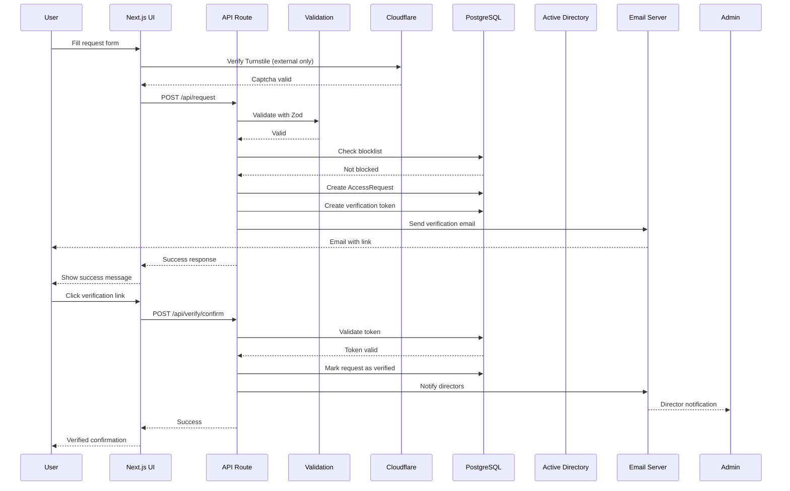

### AD Account Provisioning Flow

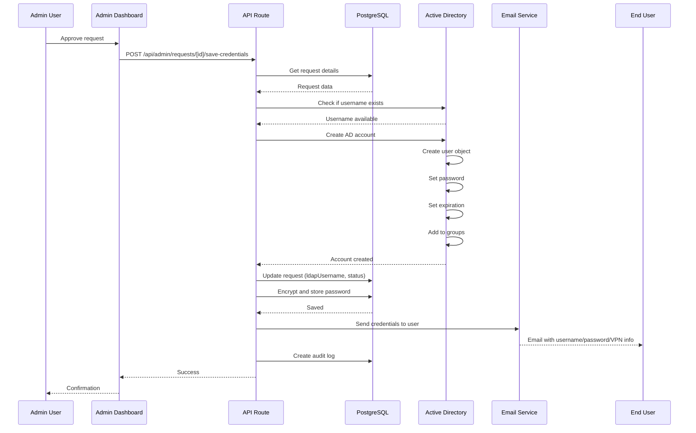

### Lifecycle Action Processing Flow

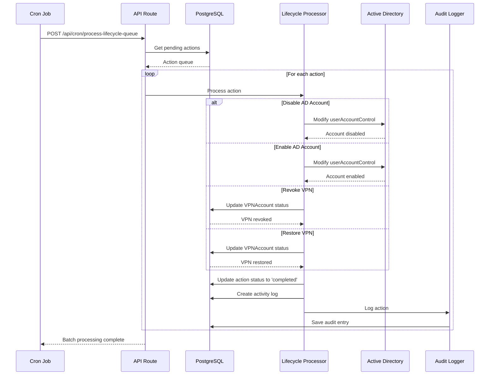

### VPN Import and Matching Flow

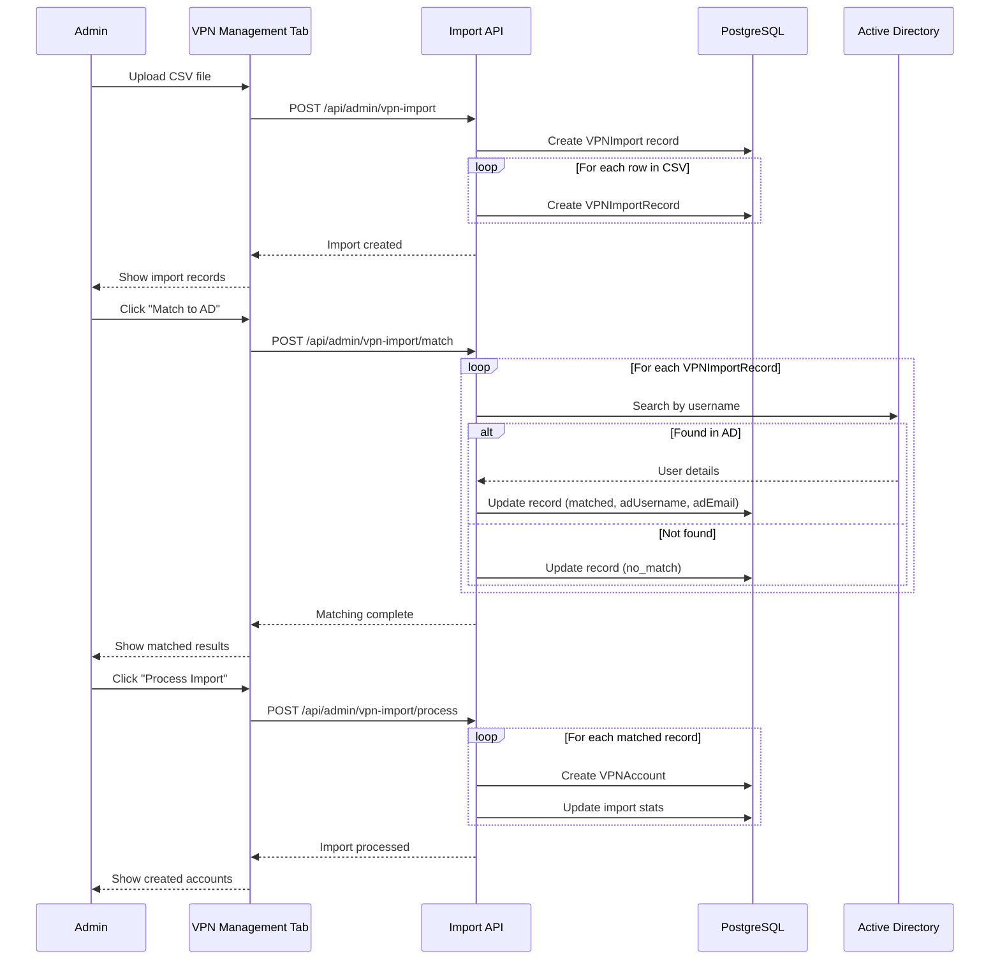

---

## Key Design Patterns

### 1. Repository Pattern
- **Prisma Client** - Single instance shared across application
- **Location**: `lib/prisma.ts`
- **Prevents**: Database connection exhaustion

### 2. Service Layer Pattern
- **LDAP Services** (`lib/ldap/`) - Encapsulated LDAP operations
- **Email Service** (`lib/email.ts`) - Centralized email sending
- **Lifecycle Processor** (`lib/lifecycle-processor.ts`) - Queue-based processing

### 3. Middleware Pattern
- **CSRF Protection** - Middleware validates tokens before route handlers
- **Session Check** - Middleware validates admin pages before rendering
- **Security Headers** - Applied to all responses

### 4. Polling Pattern
- **Custom Hook**: `hooks/usePolling.ts`
- **Usage**: Admin dashboard tabs auto-refresh
- **Features**: Configurable interval, pause/resume, localStorage persistence

### 5. Async Queue Pattern
- **Lifecycle Actions** - Queued in database, processed by cron
- **Benefits**: Non-blocking UI, retry capability, audit trail

---

## Performance Considerations

### Optimizations

1. **Database Indexing** - 82 indexes across all tables
2. **Redis Caching** - Rate limiting, future session caching
3. **LDAP Connection Pooling** - Reuse connections
4. **Lazy Loading** - Components loaded on-demand
5. **Server-Side Rendering** - Next.js App Router
6. **Static Generation** - Login page, public pages when possible

### Monitoring Points

- **Audit Logs** - Track all admin actions
- **Session Tracking** - IP, user agent, last activity
- **LDAP Query Logging** - Winston logger
- **API Response Times** - (Can be added with middleware)
- **Database Query Analysis** - Prisma query logging

---

## Deployment Checklist

### Environment Variables (Required)
- [ ] `DATABASE_URL`
- [ ] `REDIS_URL`
- [ ] `LDAP_URL`, `LDAP_BIND_DN`, `LDAP_BIND_PASSWORD`
- [ ] `LDAP_BASE`, `LDAP_SEARCH_BASE`, `LDAP_DOMAIN`
- [ ] `SMTP_HOST`, `SMTP_PORT`, `SMTP_USER`, `SMTP_PASSWORD`
- [ ] `EMAIL_FROM`, `ADMIN_EMAIL`
- [ ] `NEXTAUTH_SECRET`, `ENCRYPTION_SECRET`, `ENCRYPTION_SALT`
- [ ] `TURNSTILE_SECRET_KEY`, `NEXT_PUBLIC_TURNSTILE_SITE_KEY`

### Pre-Deployment
- [ ] Run database migrations: `npx prisma migrate deploy`
- [ ] Seed initial data (if needed)
- [ ] Test LDAP connectivity
- [ ] Test SMTP configuration
- [ ] Verify Redis connection

### Post-Deployment
- [ ] Create admin user in Active Directory
- [ ] Add admin to `LDAP_ADMIN_GROUPS`
- [ ] Test admin login
- [ ] Configure system settings
- [ ] Set up cron job for lifecycle processing
- [ ] Test email delivery
- [ ] Verify HTTPS/SSL certificates

---

## Future Enhancements

### Potential Features
1. **Two-Factor Authentication** - TOTP or SMS
2. **SSO Integration** - SAML or OAuth
3. **Mobile App** - React Native
4. **Advanced Analytics** - Dashboard with charts
5. **Automated Deactivation** - Based on expiration dates
6. **Webhook Support** - External system notifications
7. **API Versioning** - `/api/v2/...`
8. **GraphQL API** - Alternative to REST
9. **Real-time Updates** - WebSockets instead of polling
10. **Advanced Search** - Elasticsearch integration

### Technical Debt
- Migrate from polling to WebSockets for real-time updates
- Add comprehensive unit tests (Jest)
- Add integration tests (Playwright)
- Implement database query caching
- Add API rate limiting per user (currently per IP)
- Standardize error responses across all endpoints

---

## Appendix

### File Structure Overview

```
my-app/
├── app/                          # Next.js App Router
│   ├── admin/                    # Admin dashboard pages
│   ├── api/                      # API routes (83 endpoints)
│   │   ├── admin/               # Protected admin APIs (62 endpoints)
│   │   ├── auth/                # Authentication (6 endpoints)
│   │   ├── request/             # Access request (1 endpoint)
│   │   ├── support/             # Support tickets (4 endpoints)
│   │   └── ...
│   ├── login/                    # Login page
│   ├── profile/                  # User profile
│   ├── request/                  # Request forms
│   ├── support/                  # Support ticket pages
│   └── ...
├── components/                   # React components
│   ├── admin/                    # Admin-specific (24 components)
│   ├── ui/                       # Shadcn UI components (20 components)
│   └── ...
├── lib/                          # Core libraries
│   ├── ldap/                     # LDAP modules (8 files)
│   ├── email.ts                  # Email service
│   ├── prisma.ts                 # Database client
│   ├── session.ts                # Session management
│   ├── audit-log.ts              # Audit logging
│   ├── lifecycle-processor.ts   # Lifecycle queue processor
│   └── ...
├── hooks/                        # Custom React hooks
├── prisma/                       # Database schema
│   └── schema.prisma            # 31 models, 733 lines
├── public/                       # Static assets
├── types/                        # TypeScript types
├── middleware.ts                 # Next.js middleware
├── docker-compose.yml            # Docker infrastructure
└── package.json                  # Dependencies

```

### Dependency Count
- **Dependencies**: 30
- **Dev Dependencies**: 11
- **Total**: 41 packages

### Code Statistics (Approximate)
- **TypeScript Files**: ~150
- **Lines of Code**: ~50,000
- **Database Schema**: 733 lines
- **Email Templates**: 62KB

---

## Support & Maintenance

### Documentation Locations
- Main README: `/README.md`
- API Documentation: This file
- Workflows: `/.agent/workflows/`
- Environment Example: `.env.example`

### Key Workflows
- `/add-api-route` - Add new API endpoint
- `/add-component` - Add new admin component
- `/build` - Build and fix issues
- `/db-migrate` - Run database migrations
- `/format` - Format and lint code

### Contact
- **Organization**: Cal Poly Pomona Student SOC
- **Website**: https://www.calpolysoc.org
- **Data Center**: Mitchell C. Hill Student Data Center

---

**Document Version**: 1.0  
**Last Updated**: December 13, 2025  

