# UAR Web Application - Complete System Overview

> **UAR (User Access Request)** is a comprehensive account provisioning and management system for handling LDAP/Active Directory accounts, VPN access, support tickets, and administrative workflows.

---

## High-Level Architecture

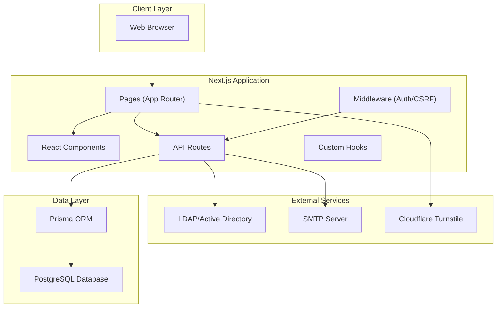

---

## Technology Stack

| Layer | Technology |
|-------|------------|
| Frontend | Next.js 14+, React, TypeScript, Tailwind CSS |
| UI Components | Shadcn UI |
| Backend | Next.js API Routes |
| Database | PostgreSQL with Prisma ORM |
| Authentication | Session-based with LDAP integration |
| Security | CSRF protection, Rate limiting, Audit logging |
| Email | Nodemailer with SMTP |
| Captcha | Cloudflare Turnstile |

---

## User Flow Diagrams

### Access Request Flow (Public Users)

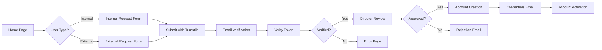

### Admin Workflow

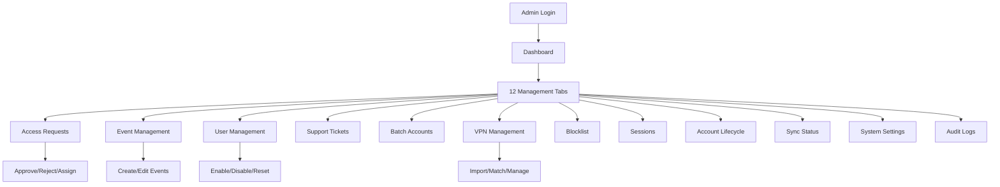

---

## Database Schema (28 Models)

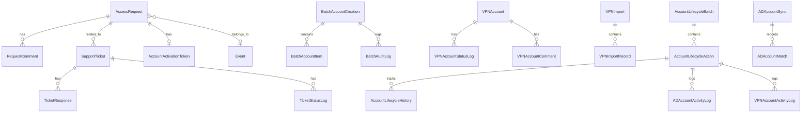

### Core Models

| Model | Purpose |
|-------|---------|
| [AccessRequest](../app/admin/page.tsx#32-48) | Main access request with full lifecycle tracking |
| [Event](../app/admin/page.tsx#49-58) | Events that trigger access requests |
| `RequestComment` | Comments on access requests |
| `AccountActivationToken` | Tokens for account activation |
| `PasswordResetToken` | Password reset tokens |

### Support System

| Model | Purpose |
|-------|---------|
| [SupportTicket](../app/admin/page.tsx#88-103) | User support tickets |
| [TicketResponse](../app/admin/page.tsx#71-78) | Responses on tickets |
| [TicketStatusLog](../app/admin/page.tsx#79-87) | Ticket status change history |

#### Support Ticket Process

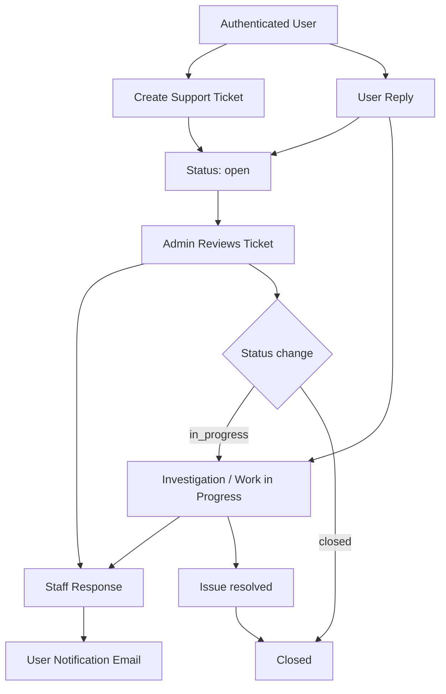

### VPN Management

| Model | Purpose |
|-------|---------|
| [VPNAccount](../app/admin/page.tsx#132-151) | VPN account records |
| `VPNAccountStatusLog` | VPN status changes |
| `VPNAccountComment` | Comments on VPN accounts |
| `VPNImport` | Bulk VPN import batches |
| `VPNImportRecord` | Individual VPN import records |
| `VPNRoleChange` | VPN role change tracking |

#### VPN Provisioning and Import Process

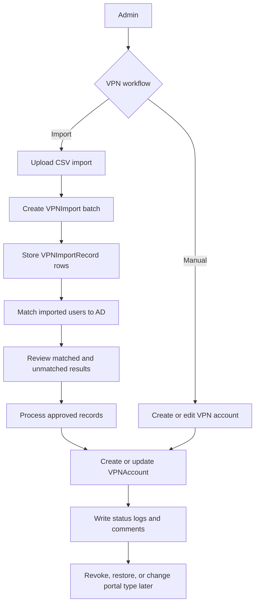

### Batch Operations

| Model | Purpose |
|-------|---------|
| `BatchAccountCreation` | Batch account creation jobs |
| `BatchAccountItem` | Individual accounts in batch |
| `BatchAuditLog` | Batch operation logs |

#### Batch Account Creation Process

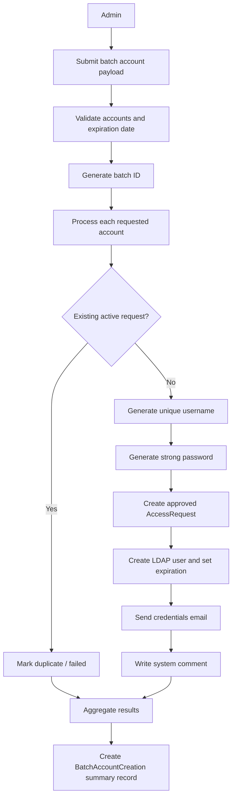

### Account Lifecycle

| Model | Purpose |
|-------|---------|
| `AccountLifecycleAction` | Disable/enable/revoke actions |
| `AccountLifecycleBatch` | Batch lifecycle operations |
| `AccountLifecycleHistory` | Lifecycle action history |
| `ADAccountActivityLog` | AD account activity |
| `VPNAccountActivityLog` | VPN account activity |
| `ADAccountComment` | Comments on AD accounts |

#### Lifecycle Processing Pipeline

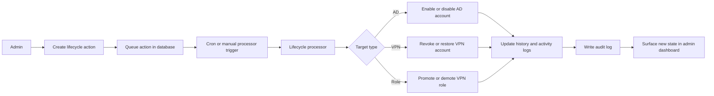

### System Management

| Model | Purpose |
|-------|---------|
| `Session` | User sessions |
| `BlockedEmail` | Blocked email addresses |
| `SystemSettings` | System configuration |
| `NotificationBanner` | System notification banners |
| `AuditLog` | Admin action audit trail |

#### System Controls and Oversight Flow

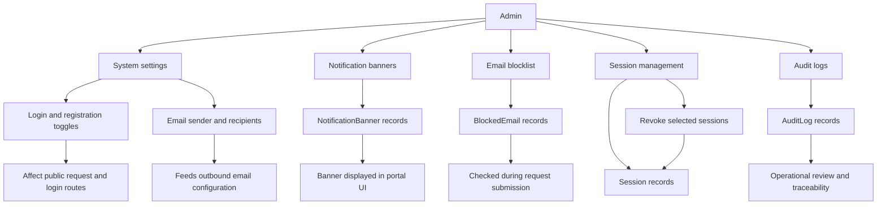

### Account Sync

| Model | Purpose |
|-------|---------|
| `ADAccountSync` | AD/VPN sync jobs |
| `ADAccountMatch` | Matched AD accounts |

#### Account Sync Reconciliation Flow

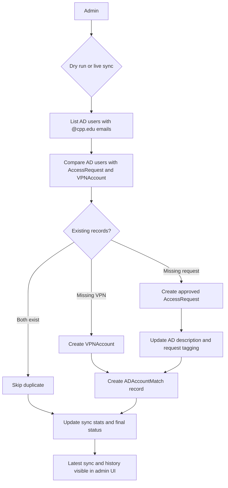

---

## Page Structure

### Public Pages

| Route | Description |
|-------|-------------|
| `/` | Home page with request workflow |
| `/login` | Admin login with Turnstile |
| `/request/internal` | Internal user request form |
| `/request/external` | External user request form |
| `/request/success` | Request submission success |
| `/verify/confirm` | Email verification confirmation |
| `/verify/success` | Verification success |
| `/verify/error` | Verification error |
| `/verify/already-verified` | Already verified notice |
| `/forgot-password` | Password reset request |
| `/reset-password` | Password reset form |
| `/instructions` | User instructions |

### Authenticated Pages

| Route | Description |
|-------|-------------|
| `/profile` | User profile management |
| `/support/create` | Create support ticket |
| `/support/tickets` | View tickets |
| `/support/tickets/[id]` | Ticket detail |
| `/account/activate` | Account activation flow |
| `/account/reset-password` | Account password reset |

### Admin Pages

| Route | Description |
|-------|-------------|
| `/admin` | Admin dashboard with 12 tabs |
| `/admin/logout` | Admin logout |

---

## Admin Dashboard Tabs

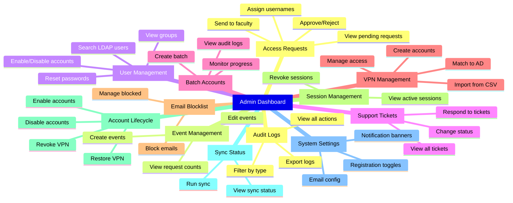

---

## API Routes Structure

### Authentication (`/api/auth/`)

| Route | Method | Purpose |
|-------|--------|---------|
| `login` | POST | Admin LDAP login |
| `logout` | POST | Session logout |
| `session` | GET | Get session info |
| `check-admin` | GET | Verify admin status |
| `request-password-reset` | POST | Request password reset |
| `reset-password` | POST | Reset password |

### Admin APIs (`/api/admin/`)

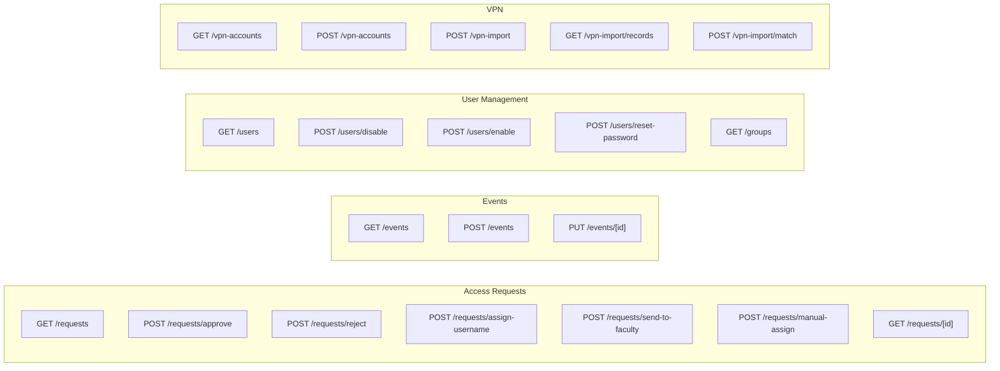

#### Complete Admin API List

| Category | Routes |
|----------|--------|
| Access Requests | `requests`, `requests/[id]/*`, `search` |
| Events | `events`, `events/[id]` |
| Users | `users`, `groups`, `ad-search`, `ad-comments` |
| VPN | `vpn-accounts`, `vpn-import/*` |
| Batch | `batch-accounts/*` |
| Blocklist | `blocklist/*` |
| Sessions | `sessions` |
| Lifecycle | `account-lifecycle/*` |
| Sync | `sync-status` |
| Settings | `settings/*`, `notifications/*` |
| Logs | `logs` |
| Utilities | `generate-password`, `check-username`, `cleanup-passwords` |

### Public APIs

| Route | Purpose |
|-------|---------|
| `/api/request` | Submit access request |
| `/api/verify/*` | Email verification |
| `/api/events` | Get active events |
| `/api/support/*` | Support ticket operations |
| `/api/profile/*` | User profile operations |
| `/api/csrf-token` | Get CSRF token |

---

## Components Architecture

### Admin Components (23)

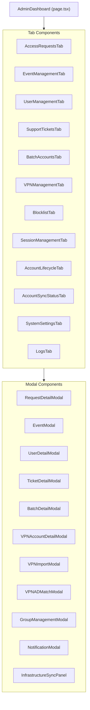

### UI Components (Shadcn)

| Component | Usage |
|-----------|-------|
| `Button` | Actions and CTAs |
| `Card` | Content containers |
| `Dialog` | Modal dialogs |
| `Input` | Text inputs |
| `Label` | Form labels |
| `Select` | Dropdowns |
| `Table` | Data tables |
| `Tabs` | Tab navigation |
| `Checkbox` | Boolean inputs |
| `Badge` | Status indicators |

---

## Library Modules

### LDAP Integration (`lib/ldap/`)

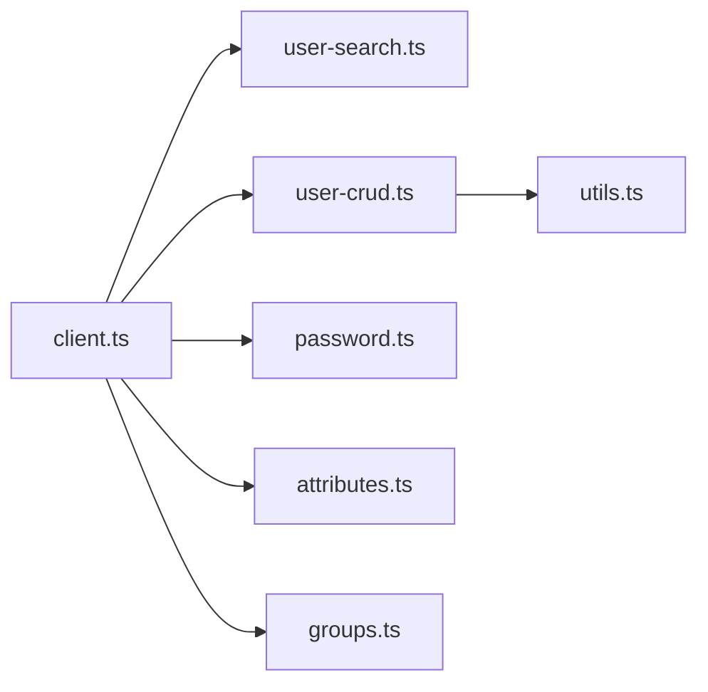

| Module | Purpose |
|--------|---------|
| [client.ts](../lib/ldap/client.ts) | LDAP connection management |
| [user-search.ts](../lib/ldap/user-search.ts) | Search users in AD |
| [user-crud.ts](../lib/ldap/user-crud.ts) | Create/Read/Update/Delete users |
| [password.ts](../lib/password.ts) | Password operations |
| [attributes.ts](../lib/ldap/attributes.ts) | User attribute management |
| [groups.ts](../lib/ldap/groups.ts) | Group membership operations |
| [utils.ts](../lib/utils.ts) | LDAP utilities |

### Email System ([lib/email.ts](../lib/email.ts))

20 email functions covering:
- Verification emails
- Admin notifications
- Account ready/activation emails
- Rejection emails
- Password reset emails
- VPN notifications
- Faculty notifications
- Ticket notifications

#### Email Delivery Pipeline

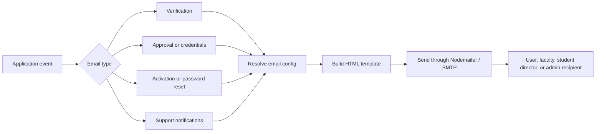

### Security Modules

| Module | Purpose |
|--------|---------|
| [session.ts](../lib/session.ts) | Session management |
| [csrf.ts](../lib/csrf.ts) | CSRF token handling |
| [ratelimit.ts](../lib/ratelimit.ts) | Rate limiting |
| [encryption.ts](../lib/encryption.ts) | Data encryption |
| [password.ts](../lib/password.ts) | Password generation/validation |
| [validation.ts](../lib/validation.ts) | Input validation |
| [audit-log.ts](../lib/audit-log.ts) | Audit logging |

### Core Utilities

| Module | Purpose |
|--------|---------|
| [prisma.ts](../lib/prisma.ts) | Database client |
| [adminAuth.ts](../lib/adminAuth.ts) | Admin authentication |
| [apiResponse.ts](../lib/apiResponse.ts) | Standardized API responses |
| [standardErrors.ts](../lib/standardErrors.ts) | Error handling |
| [env-validator.ts](../lib/env-validator.ts) | Environment validation |
| [lifecycle-processor.ts](../lib/lifecycle-processor.ts) | Account lifecycle processing |
| [infrastructure-sync.ts](../lib/infrastructure-sync.ts) | AD/VPN synchronization |

---

## Security Architecture

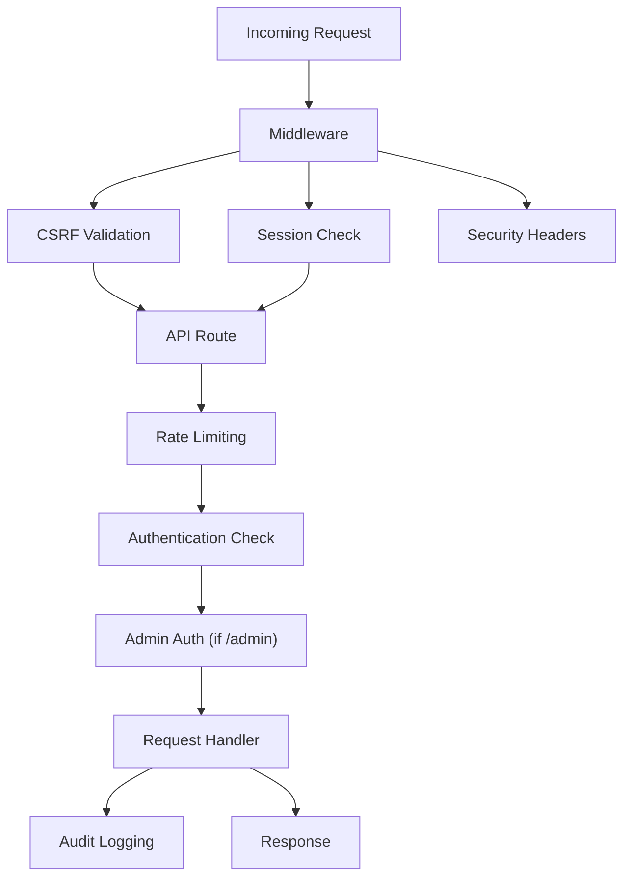

### Security Features

| Feature | Implementation |
|---------|----------------|
| **CSRF Protection** | Double-submit cookie pattern |
| **Session Management** | PostgreSQL-backed sessions with expiry |
| **Rate Limiting** | Per-IP and per-user limits |
| **Input Validation** | Zod schemas + sanitization |
| **Audit Logging** | All admin actions logged |
| **Password Security** | Strong generation, secure storage |
| **Security Headers** | HSTS, X-Frame-Options, CSP |
| **Turnstile Captcha** | Bot protection on forms |

---

## Deployment Architecture

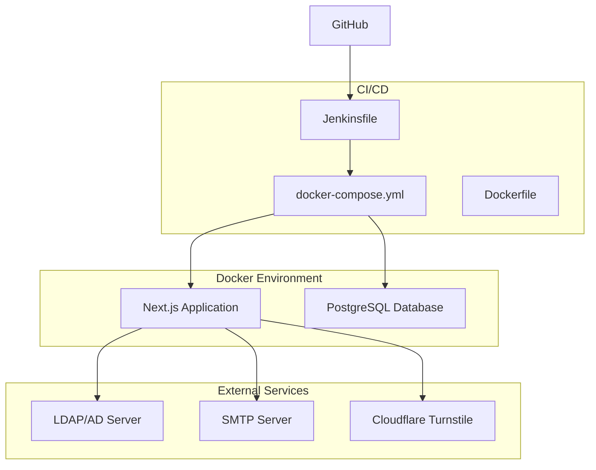

---

## Custom Hooks

| Hook | Purpose |
|------|---------|
| `usePolling` | Real-time data refresh |
| `useToast` | Toast notifications |
| `useAdminPageTracking` | Admin page view tracking |

---

## Environment Configuration

Key configuration areas:
- **Database**: PostgreSQL connection
- **LDAP**: AD server connection, base DN, credentials
- **SMTP**: Email server configuration
- **Security**: Session secrets, CSRF secrets
- **Turnstile**: Captcha site/secret keys
- **URLs**: Base URL, app URL

### Configuration Resolution Flow

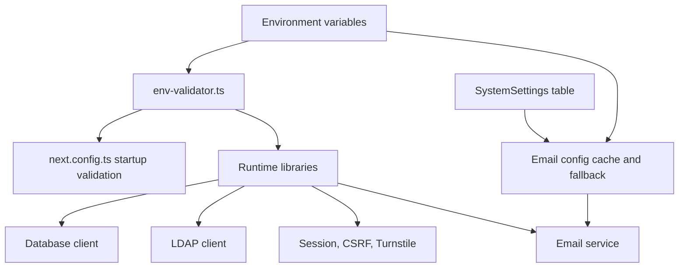

---

## Summary

The UAR Web Application is a **full-featured account management system** with:

-  **28 database models** covering all aspects of account management
-  **12 admin tabs** for comprehensive administration
-  **23+ admin components** with modals for detailed operations
-  **20+ email templates** for all user communications
-  **8 LDAP modules** for Active Directory integration
-  **Full security stack** with CSRF, sessions, rate limiting, audit logs
-  **VPN management** with import, matching, and lifecycle tracking
-  **Batch operations** for bulk account creation
-  **Support ticket system** with full workflow
-  **Account lifecycle management** for enable/disable/revoke operations
-  **Real-time polling** for live dashboard updates
-  **Docker deployment** with CI/CD pipeline
